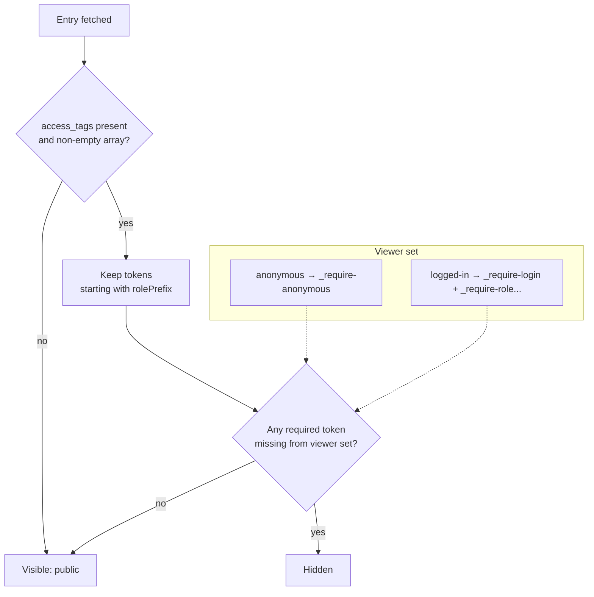
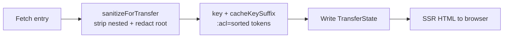

# Access Control

Presentation-level, **opt-in** content gating. Editorial component types and the per-route page types (`landing_page`, `content_page`) carry an optional multi-value text field **`access_tags`** that gates who *sees* an entry. Off unless the storefront turns it on. Implemented in [`src/cms/access/`](../src/cms/access).

The whole feature is two small pieces:

- [`ContentstackRestrictionsService`](../src/cms/access/contentstack-restrictions.service.ts) — a stateless service that turns a user into a **set of permission tokens** and decides whether a given entry is visible to that set. It also sanitizes the SSR payload and derives the per-audience cache-key suffix.
- [`CONTENTSTACK_CURRENT_USER`](../src/cms/access/contentstack-current-user.ts) — an injection token the app can override to feed the real logged-in user (specifically their role ids) into that service.

The service holds **no per-user state**: permissions are derived on demand and threaded through the call sites (adapters/normalizer), so nothing can go stale between requests. That design is what lets the same singleton serve every concurrent SSR request safely.

> [!WARNING]
> **Not a security boundary.** Gated entries are still fetched from the Delivery API (the delivery token ships in the client bundle) — a determined user can read them via the API / devtools. Use it to tailor what the UI shows, **not** to protect confidential data. Anything that must be truly confidential belongs behind an OCC/back-end authorization check, not behind `access_tags`.

---

## Token convention

Values you put in `access_tags` (empty = visible to everyone):

| Token | Effect |
|---|---|
| `_require-login` | Hidden from anonymous visitors. |
| `_require-anonymous` | Hidden once the user logs in. |
| `_require-<roleGroupId>` | Visible only to users in that SAP role group, e.g. `_require-b2badmingroup` (the id must match the SAP group exactly). |

An entry is shown only if the user holds **every** `_require-*` token on it. Tokens not starting with the role prefix are ignored (so editorial tags don't gate anything).

### How a user is turned into permission tokens

`ContentstackRestrictionsService.getPermissions()` builds the set the viewer holds:

- **Anonymous** (no user) → exactly `{ _require-anonymous }`.
- **Logged in** → `{ _require-login }` plus one `_require-<role>` token for each of the user's `roles`. A logged-in user with no roles simply holds `_require-login` (the method never throws on a missing `roles` list).

The role tokens are formed by prefixing each role id with `rolePrefix`, so SAP group `b2badmingroup` becomes the token `_require-b2badmingroup`. Because the prefix is applied on both sides — the user's roles and the enforced entry tokens — the two only match when the id in `access_tags` is byte-for-byte the SAP group id.

### How an entry's visibility is decided

`isEntryAccessible(entry, permissions)` reads the entry's `accessField` (default `access_tags`) and:

1. If it is absent, empty, or not an array → the entry is **public** (visible to everyone).
2. Otherwise it keeps only the string tokens, and the entry is visible **iff every token that starts with `rolePrefix` is present in `permissions`**. A single missing required token hides the entry.

Note the asymmetry that makes this ergonomic for authors: only tokens with the role prefix are *enforced*, so a free-text editorial tag like `campaign-q3` sitting in the same field never accidentally gates anything.


*An entry is visible only when the viewer's permission set holds every `_require-*` token on the entry; untagged entries are always public.*

**Worked examples** (defaults; `rolePrefix = _require-`):

| Entry `access_tags` | Anonymous | Logged in, no roles | Logged in, roles `[b2badmingroup]` |
|---|---|---|---|
| _(empty)_ | visible | visible | visible |
| `[_require-login]` | hidden | visible | visible |
| `[_require-anonymous]` | visible | hidden | hidden |
| `[_require-b2badmingroup]` | hidden | hidden | visible |
| `[_require-login, _require-b2badmingroup]` | hidden | hidden | visible |
| `[campaign-q3]` | visible | visible | visible |

The last row shows a non-prefixed tag being ignored. The `[_require-login, _require-b2badmingroup]` row shows the **AND** semantics: the viewer must hold both tokens, so a logged-in non-admin is still denied.

---

## Turning it on

```ts
provideConfig(<ContentstackConfig>{
  contentstack: { accessControl: { enabled: true } },
});
```

Anonymous-vs-login gating works with no further wiring. The feature module ships a **core-only default** for `CONTENTSTACK_CURRENT_USER` (login-state only — anonymous vs. logged-in, no roles), so the anonymous/login distinction resolves out of the box without pulling in `@spartacus/user`.

### Role-level gating

Role gating additionally needs the app to point the connector at the logged-in user (the connector deliberately doesn't depend on `@spartacus/user`):

```ts
import { UserAccountFacade } from '@spartacus/user/account/root';
import { CONTENTSTACK_CURRENT_USER } from '@contentstack/contentstack-spartacus-connector';

{
  provide: CONTENTSTACK_CURRENT_USER,
  useFactory: (u: UserAccountFacade) => u.get(),
  deps: [UserAccountFacade],
}
```

`CONTENTSTACK_CURRENT_USER` is an `InjectionToken<Observable<ContentstackCurrentUser | undefined>>`. The `ContentstackCurrentUser` shape the connector needs is deliberately minimal — just `roles?: string[]`. Spartacus's own `User` is structurally assignable to it (both carry `roles?: string[]`), so the one-line factory type-checks with **no cast**. Keeping the shape local is what makes role-level gating a genuinely optional, app-wired capability: the library imports nothing from `@spartacus/user`, so there is no forced dependency and no bundle-coupling if the host app doesn't have the User feature.

When the observable emits `undefined` (no user), `getPermissions()` treats the viewer as anonymous. When it emits a user whose `roles` are still loading (empty/absent), the viewer holds only `_require-login` until the roles arrive — worth remembering if a role-gated island appears to "flash" for a freshly-authenticated user.

---

## Options

Defaults are configurable on `contentstack.accessControl` (see [contentstack.accessControl — opt-in content gating](configuration.md#contentstackaccesscontrol-opt-in-content-gating)):

| Option | Default | Purpose |
|---|---|---|
| `enabled` | `false` | Master switch. When off, every path behaves as if gating is absent. |
| `accessField` | `access_tags` | Entry field uid holding the required-token list (a multi-value text field on the content type). |
| `anonymousToken` | `_require-anonymous` | Token granted to anonymous visitors. |
| `loginToken` | `_require-login` | Token granted to any logged-in user. |
| `rolePrefix` | `_require-` | Prefix applied to each role id to form its token; only entry tokens with this prefix are enforced. |
| `gateSharedSlugPages` | `false` | Whether page-level gating also applies to shared-slug product/category layouts. |

Shared-slug product/category pages are not gated by default (`gateSharedSlugPages: false`) — one shared entry would otherwise gate every SKU/category at once, which is rarely intended (real product data comes from OCC regardless). The global shell (header/footer/nav) is **never** gated.

If you rename any of these (for instance point `accessField` at a differently-named field), the service reads your configured value everywhere — `getPermissions`, `isEntryAccessible`, and `redactEntry` all fall back to the same defaults listed above only when the option is unset.

---

## SSR caching caveat

With gating on, the connector filters restricted content out of the SSR payload *before* it is written (so a user's page source only contains what they may see), and the Contentstack SSR cache key is scoped per permission set.

Concretely, `sanitizeForTransfer(entry, permissions, gateRoot)` runs before the TransferState write and:

- **strips** nested referenced entries the viewer can't access from the tree — removed from reference arrays and deleted from single-reference fields (recursively, depth-guarded against cyclic payloads); and
- when `gateRoot` is true **and** the root entry itself is inaccessible, reduces it to a **tags-only stub** via `redactEntry` — keeping `uid`, `_content_type_uid`, and the access field, dropping every content field. Downstream gating still sees the stub as *restricted* (its tags survive), so "restricted" stays distinct from "absent".

The cache key gets a stable, per-audience suffix from `cacheKeySuffix(permissions)` — of the form `:acl=<sorted tokens joined by |>` — so a payload filtered for one permission set is never replayed to a different audience. When gating is off (or the permission set is empty) the suffix is empty and cache keys are byte-for-byte identical to before.


*Restricted content is filtered out before the SSR write, and the payload is stored under a per-permission-set cache key.*

> [!WARNING]
> If you put a **shared** cache (CDN / SSR cache) in front of the app, you must still send `Cache-Control: private` (or `Vary` on the identity that drives permissions) for gated routes, so one audience's rendered page is never served to another. The `cacheKeySuffix` only scopes the connector's *internal* TransferState cache; it cannot influence an upstream CDN that keys purely on URL.

---

## Related

- [content-model](content-model.md) — the `access_tags` field on component and page types (§ content gating)
- [configuration](configuration.md) — the `accessControl` option block
- [Access control](api-reference.md#access-control) — `CONTENTSTACK_CURRENT_USER`, `ContentstackRestrictionsService`
- Repository doc: [`CONTENT-MODEL.md` §4.5](../CONTENT-MODEL.md)
