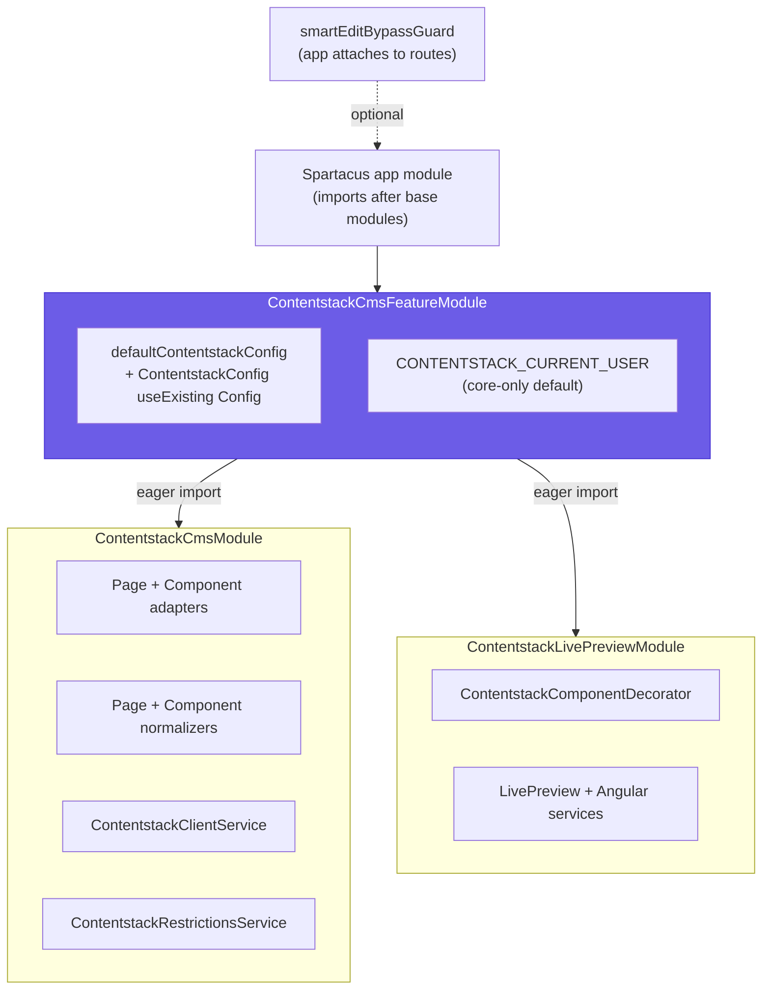

# API Reference

The public API surface, as exported from [`src/public-api.ts`](../src/public-api.ts). A Spartacus app typically only needs **`ContentstackCmsFeatureModule`** plus the **`ContentstackConfig`** type; the rest is provided for advanced customization (custom adapters, normalizers, or reusing the client service in bespoke components).

Every row in the tables below corresponds one-to-one to an `export * from '...'` line in [`public-api.ts`](../src/public-api.ts) — the **From** column is the module path exactly as it appears there. Nothing is exported that isn't listed here, and nothing here is missing from the barrel.

> **How to read this page.** Most integrations touch only the first two tables (the [Entry point](#entry-point) and [Configuration](#configuration)). The [CMS override layer](#cms-override-layer), [Access control](#access-control), and [Live Preview / Visual Editor](#live-preview--visual-editor) exports are the internals the feature module wires up for you — you reference them directly only when you extend or replace a piece. See [architecture](architecture.md) for how these symbols compose at runtime.

## What a consumer imports

Almost all of the surface below is reached transitively through one import. `ContentstackCmsFeatureModule` eagerly imports the CMS override module and the Live Preview module, and registers the config, access-control, and guard pieces — so importing that one module activates the whole integration.



*The composition a consumer imports: one feature module eagerly pulls in the CMS override (adapters, normalizers, client, restrictions) and Live Preview, and registers the config + current-user defaults; the SmartEdit bypass guard is the one piece the app attaches itself.*

---

## Entry point

| Export | From | Purpose |
|---|---|---|
| `ContentstackCmsFeatureModule` | `contentstack-cms-feature.module` | **The single module a Spartacus app imports.** Registers config, binds `ContentstackConfig` to Spartacus's `Config`, and eagerly imports the CMS override + Live Preview modules. Import it **after** the base Spartacus modules. |

**When to use it.** In every integration — this is the only import required to turn the connector on. Add it once to your app's module graph (in a standard `ng add @spartacus/schematics` app, `SpartacusFeaturesModule`, or anywhere after `StorefrontModule`).

**What importing it does**, per [`contentstack-cms-feature.module.ts`](../src/contentstack-cms-feature.module.ts):

1. Imports [`ContentstackCmsModule`](#cms-override-layer) **eagerly** — the adapter must resolve the very first page at bootstrap, so it can't sit behind a lazy `featureModules` gate.
2. Imports [`ContentstackLivePreviewModule`](#live-preview--visual-editor) **eagerly** — registers the `ComponentDecorator` override; the Live Preview SDK only actually initializes when `delivery.livePreview` is set, so it stays inert on normal delivery builds.
3. Registers [`defaultContentstackConfig`](#configuration) via `provideDefaultConfig`, so the app only supplies credentials.
4. Binds `{ provide: ContentstackConfig, useExisting: Config }`, so injecting `ContentstackConfig` yields the merged global config.
5. Provides a **core-only** default for [`CONTENTSTACK_CURRENT_USER`](#access-control) (login-state only, no roles), depending solely on `@spartacus/core`'s `AuthService`.

**Why import order matters.** `CmsOccModule` (in the Spartacus base) binds the OCC adapters to the abstract `CmsPageAdapter` / `CmsComponentAdapter` tokens. The connector re-provides those same tokens; Angular DI's "last provider wins" rule only routes CMS loads to Contentstack if the feature module is imported *after* the OCC bindings.

```ts
// app.module.ts (illustrative)
@NgModule({
  imports: [
    StorefrontModule,               // base Spartacus (includes CmsOccModule)
    ContentstackCmsFeatureModule,   // ← after the base, so our adapters win
  ],
  providers: [
    provideConfig(<ContentstackConfig>{
      contentstack: {
        delivery: { apiKey: '...', deliveryToken: '...', environment: 'production' },
      },
    }),
  ],
})
export class AppModule {}
```

What it deliberately does **not** do: it does not import Spartacus's `SmartEditRootModule` (that omission is the primary SmartEdit bypass — see [SmartEdit bypass](#smartedit-bypass)), and it does not register any `cmsComponents` mappings (mapping Contentstack types to Angular components is app-specific — see the `examples/hero-banner` pattern).

---

## Configuration

| Export | From | Purpose |
|---|---|---|
| `ContentstackConfig` | `config/contentstack-config` | The fully-typed config interface (augments Spartacus's `Config`). See [configuration](configuration.md). |
| `defaultContentstackConfig` | `config/default-contentstack-config` | Shipped defaults — spread when extending array options like `includeReferences`. |

**`ContentstackConfig`** is an `abstract class` that also augments `@spartacus/core`'s `Config` (via `declare module '@spartacus/core'`), so you provide it exactly like any other Spartacus config slice — through `provideConfig(...)` / `provideDefaultConfig(...)` — and inject it wherever DI is available. Its shape (see [`contentstack-config.ts`](../src/config/contentstack-config.ts)) covers delivery credentials (`delivery.{apiKey, deliveryToken, environment, region, branch}`), the Live Preview toggle (`delivery.{livePreview, previewToken, previewHost}`), routing (`slugField`, `slugTransform`, `pageTypeMapping`, `cmsPageContentType`, `componentContentType`), localization (`localeMapping`, `includeFallback`), rendering mode (`occFallback`), slot extension (`additionalSlotFields`, `componentTypeMapping`, `globalSlots`, `includeReferences`), gating (`accessControl`), and resilience (`timeoutMs`). Every field is documented field-by-field in [configuration](configuration.md).

**When to use `defaultContentstackConfig`.** App-level `provideConfig` deep-merges over the defaults, so most fields you simply omit and inherit. The one case to import the default explicitly is when you **extend an array** rather than replace it — arrays don't deep-merge — most commonly `includeReferences`:

```ts
import { defaultContentstackConfig } from '@contentstack/contentstack-spartacus-connector';

provideConfig(<ContentstackConfig>{
  contentstack: {
    includeReferences: [
      ...(defaultContentstackConfig.contentstack?.includeReferences ?? []),
      'my_custom_slot.banner',
    ],
  },
});
```

The shipped defaults include `slugField: 'url'`, `occFallback: true` (hybrid mode), `includeFallback: false`, `cmsPageContentType: 'cms_page'`, `timeoutMs: 10000`, `delivery.branch: 'main'`, `delivery.livePreview: false`, `accessControl.enabled: false`, and an `includeReferences` list covering every page slot plus header/footer (from `PAGE_REFERENCE_FIELDS` in `slot-maps.ts`). Note `cms_page` is a generic placeholder default — the starter pack models pages as `landing_page`, so set `cmsPageContentType` accordingly.

---

## Client

| Export | From | Purpose |
|---|---|---|
| `ContentstackClientService` | `client/contentstack-client.service` | Wraps `@contentstack/delivery-sdk`; queries entries by slug and expands configured reference fields. Reuse it in custom components that need raw Contentstack reads. |

**When to use it.** Inject it in a custom component or resolver that needs to read Contentstack content the CMS store doesn't already hold — e.g. a bespoke widget that pulls its own entry. The connector's own adapters depend on this service (never on the SDK directly), so reusing it keeps SSR and resilience behavior consistent.

**Role.** `ContentstackClientService` is the single seam between the library and Contentstack. Per [`contentstack-client.service.ts`](../src/client/contentstack-client.service.ts), every Delivery API call routes through it so three concerns live in one place:

- **Auth + region** — builds the `@contentstack/delivery-sdk` stack once from `ContentstackConfig` (lazily, memoized), and refuses to activate Live Preview outside dev mode so draft content can't leak to production.
- **SSR** — wraps each fetch in Angular `TransferState`, so content fetched during server-side rendering is serialized into the page and the browser doesn't re-fetch on hydration.
- **Resilience** — applies the configured `timeoutMs` and converts failures to an empty result, so a slow or unreachable CMS never hangs the storefront.

Its public methods: `getPageBySlug(...)`, `getGlobalSlots(...)`, `getEntryByUid(...)`, `getEntriesByUids(...)`, the `sdkStack` getter (the underlying delivery-sdk `Stack`), and `applyLivePreviewHash(hash)` (used by Live Preview to resolve the draft of the entry being edited). Access-gated reads accept an optional `EntryAccessOptions` so restricted content is filtered *before* it is written to `TransferState`.

---

## CMS override layer

| Export | From | Purpose |
|---|---|---|
| `ContentstackCmsModule` | `cms/contentstack-cms.module` | The adapter-override module (imported eagerly by the feature module). |
| `ContentstackCmsPageAdapter` | `cms/adapters/contentstack-cms-page.adapter` | Replaces the OCC `CmsPageAdapter`; resolves a page by slug. |
| `ContentstackCmsComponentAdapter` | `cms/adapters/contentstack-cms-component.adapter` | Replaces the OCC `CmsComponentAdapter`; standalone/shared component lookups. |
| `ContentstackCmsPageNormalizer` | `cms/converters/contentstack-cms-page.normalizer` | Contentstack page entry → Spartacus `CmsStructureModel`. |
| `ContentstackCmsComponentNormalizer` | `cms/converters/contentstack-cms-component.normalizer` | Dispatches a component to its type-specific normalizer by typecode. |
| `ContentstackFieldMapper` | `cms/converters/contentstack-field-mapper` | Shared field/uid ↔ typecode/slot mapping helpers. |

**When to use these.** You rarely import them directly — `ContentstackCmsModule` is pulled in for you by the feature module. Reach for them when you customize the pipeline: re-provide `CmsPageAdapter` / `CmsComponentAdapter` with a subclass to change how pages/components resolve, or inject a normalizer / `ContentstackFieldMapper` from a custom adapter.

**How the override works** ([`contentstack-cms.module.ts`](../src/cms/contentstack-cms.module.ts)): `ContentstackCmsModule` re-provides the abstract `CmsPageAdapter` and `CmsComponentAdapter` tokens with the Contentstack adapters. Because everything upstream (`CmsPageConnector`, the CMS NgRx store, the rendering engine) depends only on those abstract tokens, and this module is imported after the OCC bindings, "last provider wins" routes every CMS load through Contentstack — with nothing else changed. The module intentionally does **not** register the shared `CMS_PAGE_NORMALIZER` / `CMS_COMPONENT_NORMALIZER` multi-tokens (those already carry the OCC normalizers); the adapters invoke the Contentstack normalizers **directly** so an OCC-shaped transform never runs over Contentstack JSON.

- **`ContentstackCmsPageAdapter`** — on navigation, Spartacus resolves a `PageContext` and calls `load()`; the adapter translates it into a Delivery API query by URL slug and runs the result through `ContentstackCmsPageNormalizer`. It merges in `globalSlots` (shared shell) and, for `SMART_EDIT_CONTEXT`, returns an empty structure.
- **`ContentstackCmsComponentAdapter`** — mostly dormant: the page normalizer already emits a flat `components[]` that Spartacus loads into the store, so this adapter fires only when Spartacus asks for a shared/reusable component by uid that isn't in the store. In hybrid mode (`occFallback: true`, default) a component Contentstack doesn't have is served from SAP via the injected `OccCmsComponentAdapter`; with `occFallback: false` it returns a shell result and standalone lookups require `componentContentType`.
- **`ContentstackCmsPageNormalizer`** — translates a raw page entry (e.g. a `landing_page`) into a native `CmsStructureModel` (`page` + flat `components[]`), so the stock rendering engine (`PageLayoutComponent → PageSlotComponent → ComponentWrapperDirective`) draws Contentstack content with no forked renderer. Slot discovery is an allowlist driven by `SLOT_FIELD_TO_SAP_NAME`.
- **`ContentstackCmsComponentNormalizer`** — builds the base `CmsComponent` shape, resolves the SAP `typeCode` via `toTypeCode`, then composes the banner / navigation / product-carousel normalizers by direct method call keyed off the typecode.
- **`ContentstackFieldMapper`** — maps an author-friendly block's fields (`image_url`, `link_name`, …) onto the exact field names the **stock** Spartacus components read from `CmsComponentData`, so authors don't have to mirror OCC's payload shape. Unknown types fall through as a raw passthrough.

### Component normalizers

These are the type-specific normalizers `ContentstackCmsComponentNormalizer` dispatches to by SAP typecode. Import one directly only if you subclass or reuse its per-component transform.

| Export | From |
|---|---|
| Banner normalizer | `cms/converters/components/contentstack-cms-banner-component.normalizer` |
| Navigation normalizer | `cms/converters/components/contentstack-cms-navigation-component.normalizer` |
| Product carousel normalizer | `cms/converters/components/contentstack-cms-product-carousel-component.normalizer` |

The dispatcher routes SAP banner typecodes (`SimpleResponsiveBannerComponent`, `SimpleBannerComponent`) to the banner normalizer, nav typecodes (`CategoryNavigationComponent`, `FooterNavigationComponent`, `NavigationComponent`) to the navigation normalizer (which reassembles the flat `nav_node_flat` pool into a tree by `parent_id`), and product-carousel entries to the carousel normalizer.

### Model & mapping

Low-level building blocks the normalizers consume. Import these when you write a custom normalizer or need the same runtime shape checks / mapping tables.

| Export | From | Purpose |
|---|---|---|
| Model types | `cms/model/contentstack.model` | Contentstack payload/entry shapes the normalizers consume. |
| Type guards | `cms/model/type-guards` | Runtime shape checks (e.g. `isMediaContainer()`). |
| Slot maps | `cms/model/slot-maps` | `SLOT_FIELD_TO_SAP_NAME`, `toTypeCode`, `toSlotName`. |

- **Model types** — the loosely-typed Delivery API shapes (`ContentstackEntry`, `ContentstackCmsPageEntry`, `ContentstackReference`, `ContentstackFile`, …).
- **Type guards** — narrow those shapes safely: `isResolvedEntry()` (a fully-expanded entry vs. a bare reference pointer), `isMediaContainer()`, `isContentstackFile()`, `isString()`.
- **Slot maps** — the translation tables between Contentstack's lowercase snake_case uids and SAP's PascalCase typecodes / slot position names (`TYPECODE_MAP`, `SLOT_FIELD_TO_SAP_NAME`, plus the `toTypeCode` / `toSlotName` helpers and `PAGE_REFERENCE_FIELDS`).

---

## Access control

| Export | From | Purpose |
|---|---|---|
| `CONTENTSTACK_CURRENT_USER` | `cms/access/contentstack-current-user` | Injection token the app provides to feed the logged-in user (role-level gating). See [Role-level gating](access-control.md#role-level-gating). |
| `ContentstackRestrictionsService` | `cms/access/contentstack-restrictions.service` | Filters entries by the viewer's tokens; scopes SSR caching per permission set. |

**When to use `CONTENTSTACK_CURRENT_USER`.** The feature module provides a **core-only default** (login state → anonymous vs. logged-in, no roles), depending only on `@spartacus/core`'s `AuthService`. Override this token in your app to enable **role-level** gating — emit the real user from `@spartacus/user`'s `UserAccountFacade`:

```ts
import { UserAccountFacade } from '@spartacus/user/account/root';
import { CONTENTSTACK_CURRENT_USER } from '@contentstack/contentstack-spartacus-connector';

{ provide: CONTENTSTACK_CURRENT_USER,
  useFactory: (u: UserAccountFacade) => u.get(),
  deps: [UserAccountFacade] }
```

`@spartacus/core`'s `User` is structurally assignable to the connector's local `ContentstackCurrentUser` (both carry `roles?: string[]`), so that one-line factory type-checks with no cast — and keeps `@spartacus/user` an app-side concern, never a connector dependency.

**Role of `ContentstackRestrictionsService`.** It derives the permission tokens a viewer holds (`getPermissions()`), filters gated entries by those tokens, and — because filtering runs *before* the SSR `TransferState` write (`sanitizeForTransfer()`) — restricted content never ships in the server-rendered payload. It also contributes a `cacheKeySuffix(...)` so SSR caching is scoped per permission set (a gated page cached for one audience isn't served to another). The service is stateless: permissions are threaded through call sites, never stored, so there's no per-user state to go stale.

> **Not a security boundary.** Gating is presentation-level. The delivery token is in the client bundle, so a determined user can still read gated entries directly from the Delivery API — use gating to tailor what the UI shows, not to protect confidential data. See [access-control](access-control.md) for the full model, token conventions (`_require-anonymous`, `_require-login`, `_require-<role>`), and the `accessControl` config fields.

---

## SmartEdit bypass

| Export | From | Purpose |
|---|---|---|
| `smartEditBypassGuard` | `guards/contentstack-smartedit-bypass` | Route guard that strips legacy SmartEdit preview params. |

**When to use it.** Attach `smartEditBypassGuard` (a functional `CanActivateFn`) to any route that might receive legacy SAP SmartEdit preview params — typically the catch-all content route. It's the **secondary** bypass mechanism; the **primary** one is architectural — the feature module never imports `SmartEditRootModule`, so nothing registers the `CmsTicketInterceptor` or the SmartEdit-handshake `APP_INITIALIZER` that would otherwise block startup on the (now removed) SAP CMS layout engine.

**Behavior** ([`contentstack-smartedit-bypass.ts`](../src/guards/contentstack-smartedit-bypass.ts)): if an inbound URL carries any of `cmsTicketId`, `cmsTicket`, or `liveEditMode`, the guard strips them and re-navigates to the clean URL (returning a `UrlTree`) so the page renders normally from Contentstack; otherwise it returns `true`. Combined with the page adapter returning an empty structure for `SMART_EDIT_CONTEXT`, these layers guarantee the storefront never stalls on SmartEdit. SAP CMS preview is replaced by Contentstack Live Preview (below).

---

## Live Preview / Visual Editor

| Export | From | Purpose |
|---|---|---|
| `ContentstackLivePreviewModule` | `live-preview/contentstack-live-preview.module` | Live Preview module (imported eagerly by the feature module). |
| `ContentstackAngularService` | `live-preview/contentstack-angular.service` | Bridges the Live Preview runtime to Angular change detection. |
| `ContentstackLivePreviewService` | `live-preview/contentstack-live-preview.service` | Sets up the SDK and drives live content refreshes. |
| `ContentstackComponentDecorator` | `live-preview/contentstack-component.decorator` | DI provider registered over Spartacus's `ComponentDecorator` extension point; tags each rendered component wrapper with a whole-entry `data-cslp` tag. |
| `CsEditableDirective` | `live-preview/cs-editable.directive` | `csEditable` — per-field edit tags. |
| `CsEmptyBlockParentDirective` | `live-preview/cs-empty-block-parent.directive` | Empty-slot affordance for the Visual Builder. |

**When to use these.** `ContentstackLivePreviewModule` is imported for you by the feature module — but the SDK only actually initializes when `delivery.livePreview` is `true` (`ContentstackLivePreviewService`'s constructor returns early otherwise), so on a normal delivery build these stay inert. (A separate guard governs *draft* routing: the delivery client only routes through the preview host when `livePreview` is `true`, a `previewToken` is set, **and** the build is non-production — see [Client](#client).) Reach for the **directives** in your own module components to make individual fields and empty slots editable in the Visual Builder; the services are mostly internal.

- **`ContentstackLivePreviewModule`** — registers `ContentstackComponentDecorator` over Spartacus's `ComponentDecorator` extension point (the same "last-provider-wins" DI mechanism the CMS module uses, here with `multi: true` because `ComponentDecorator` is a multi-provider).
- **`ContentstackLivePreviewService`** — initializes the Live Preview SDK once per bootstrap and, on every Contentstack edit, re-fetches the current page and pushes updated component data into the CMS NgRx store, so edits reflect with no refresh or redeploy.
- **`ContentstackAngularService`** — the thin wrapper around Contentstack's real `@contentstack/live-preview-utils` SDK (its `init` / `onEntryChange` contract), bridging the runtime to Angular change detection.
- **`ContentstackComponentDecorator`** — a DI provider registered over Spartacus's `ComponentDecorator` extension point (`multi: true`), applied globally to every rendered component wrapper — not a decorator you write as `@ContentstackComponent` on a class. Its `decorate()` applies a coarse, whole-entry `data-cslp` tag on each wrapper (component-to-entry navigation, the Inspector-Mode equivalent); per-field tagging is a separate concern handled by `CsEditableDirective`.
- **`CsEditableDirective`** (`[csEditable]`) — per-field edit tags, the reusable equivalent of hand-binding `[attr.data-cslp]` on every field. `standalone: true`, so import it directly into the template that uses it:

  ```html
  <h1 [csEditable]="entry.$?.title">{{ entry.title }}</h1>
  ```

- **`CsEmptyBlockParentDirective`** (`[csEmptyBlockParent]`) — marks a slot container as an "empty block parent" so an empty slot renders the Visual Builder's add-a-block placeholder / drop target. Also `standalone: true`:

  ```html
  <div [csEmptyBlockParent]="slot.components">…components…</div>
  ```

See [live-preview](live-preview.md) for setup, the preview-build requirement, and end-to-end usage.

---

## Example component (illustrative)

The `hero-banner` exports demonstrate live SAP hydration (reading a SKU from Contentstack, pulling price/stock via `ProductService` / `ActiveCartFacade`). Real components live in the consuming app — copy the pattern, don't depend on these directly.

| Export | From |
|---|---|
| Hero model | `examples/hero-banner/hero.model` |
| `CustomHeroComponent` | `examples/hero-banner/custom-hero.component` |
| `CustomHeroModule` | `examples/hero-banner/custom-hero.module` |

**When to use these.** As a reference only. They show the canonical "editable island" pattern — content and layout authored in Contentstack, commerce data (price, stock, cart) hydrated live from SAP OCC at render time — and how a `cmsComponents` mapping wires a Contentstack block type to an Angular component. Reproduce the pattern in your own app rather than importing these symbols, since the connector ships no `cmsComponents` mappings itself.

---

## Related

- [architecture](architecture.md) — how these symbols compose at runtime
- [configuration](configuration.md) — the `ContentstackConfig` fields
- [installation](installation.md) — importing `ContentstackCmsFeatureModule`
- [access-control](access-control.md) — the gating model behind `CONTENTSTACK_CURRENT_USER`
- [live-preview](live-preview.md) — Visual Editor setup and directive usage
