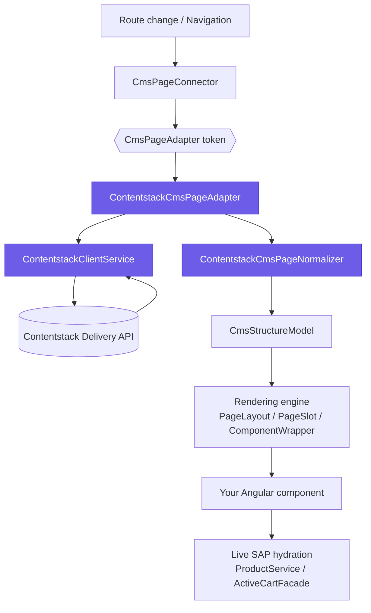
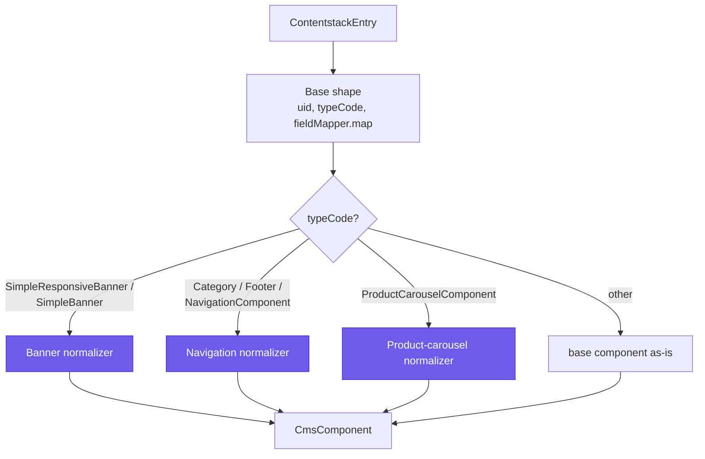
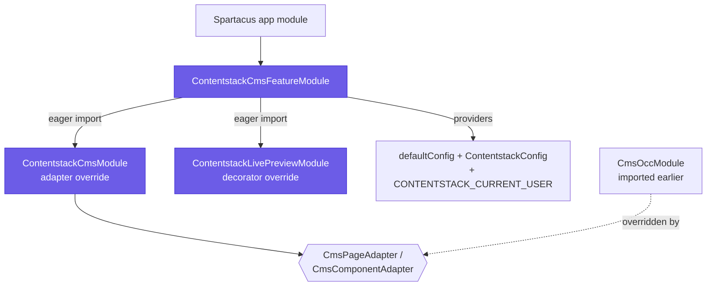

# Architecture

How the connector slots into Spartacus's rendering pipeline. For the mental model, read [concepts](concepts.md) first.

The connector is deliberately small: it does not fork Spartacus's renderer, its CMS NgRx store, or its layout engine. It substitutes exactly two abstract DI tokens — `CmsPageAdapter` and `CmsComponentAdapter` — so page and component **content** resolves from Contentstack's Delivery API instead of SAP OCC, while everything above the adapter (the connector, the store, `PageLayoutComponent → PageSlotComponent → ComponentWrapperDirective`) runs unchanged. Product, cart, and pricing data still hydrate live from SAP.

---

## The CMS adapter-override chain

Spartacus resolves a page through a chain of abstract adapters. The connector replaces the OCC implementations of those adapters with Contentstack-backed ones:


*The override chain: Spartacus routing flows through the Contentstack adapter (purple), which fetches + normalizes CMS content, then hands a native `CmsStructureModel` back to the stock renderer; SAP still supplies live product/cart data.*

The key move: because these adapters are **abstract DI tokens**, providing a new implementation *after* the OCC one wins the binding (last-provider-wins). No Spartacus core code is patched.

### How last-provider-wins works, concretely

`CmsOccModule` (part of the Spartacus base) binds the abstract tokens to OCC:

```ts
{ provide: CmsPageAdapter,      useExisting: OccCmsPageAdapter }
{ provide: CmsComponentAdapter, useExisting: OccCmsComponentAdapter }
```

`ContentstackCmsModule` ([`src/cms/contentstack-cms.module.ts`](../src/cms/contentstack-cms.module.ts)) re-provides the *same two tokens* against the Contentstack adapters:

```ts
{ provide: CmsPageAdapter,      useExisting: ContentstackCmsPageAdapter }
{ provide: CmsComponentAdapter, useExisting: ContentstackCmsComponentAdapter }
```

Angular's root injector keeps the **last** provider for a token, so when this module is imported *after* `CmsOccModule`, injecting `CmsPageAdapter` anywhere upstream yields the Contentstack adapter. `CmsPageConnector`, the CMS NgRx store, and the rendering engine all depend only on the abstract token, so none of them are aware of the swap — which is exactly why the override is non-invasive. This is also why import order is load-bearing (see [Module composition and DI ordering](#module-composition-and-di-ordering)).

Note the module intentionally does **not** register `CMS_PAGE_NORMALIZER` / `CMS_COMPONENT_NORMALIZER`. Those are multi-provider tokens that already carry the OCC normalizers; adding the Contentstack normalizers there would run the OCC transform over Contentstack JSON. Instead, the adapters call the Contentstack normalizers directly, keeping the two sources cleanly isolated.

---

## Request flow, end to end

```mermaid
sequenceDiagram
  participant R as Router
  participant A as ContentstackCmsPageAdapter
  participant C as ContentstackClientService
  participant D as Delivery API
  participant O as OccCmsPageAdapter
  participant N as Page + Component Normalizers
  participant E as Spartacus renderer
  R->>A: load(PageContext)
  A->>A: resolveRequest → contentType, slugField, slug
  par Contentstack
    A->>C: getPageBySlug(...) + getGlobalSlots(...)
    C->>D: query by slug (includeReference)
    D-->>C: entry(s)
    C-->>A: page + global entries
  and Hybrid base
    A->>O: load(PageContext) (occFallback)
    O-->>A: OCC base structure
  end
  A->>N: normalize entries
  N-->>A: CmsStructureModel
  A->>A: mergeStructures(occBase, global, page)
  A-->>E: CmsStructureModel
  E->>E: render slots; components hydrate live SAP data
```
*The numbered request flow: the adapter fetches Contentstack content and the OCC base in parallel, normalizes, layers them, and returns one native structure model.*

1. **Route change** → Spartacus's `CmsPageConnector` asks the `CmsPageAdapter` to load the page for the current context (slug).
2. **`ContentstackCmsPageAdapter`** ([`src/cms/adapters/contentstack-cms-page.adapter.ts`](../src/cms/adapters/contentstack-cms-page.adapter.ts)) resolves the request via `resolveRequest()` — a `sharedSlug` route (product/category) maps to one shared layout entry; the homepage maps to slug `/`; every other route maps per-slug on `slugField == pageContext.id` (optionally rewritten by `slugTransform`). It then queries Contentstack through **`ContentstackClientService`** ([`src/client/contentstack-client.service.ts`](../src/client/contentstack-client.service.ts)), expanding configured reference fields via the Delivery SDK's `includeReference`.
3. **In parallel**, the adapter also fetches the shared shell (`getGlobalSlots`) and — when `occFallback` is on (the default) — the SAP page for this route via the injected `OccCmsPageAdapter`. A CMS failure is caught and degrades to no-base so navigation never breaks (`.pipe(catchError(() => of(undefined)))`, page adapter L138).
4. **`ContentstackCmsPageNormalizer`** ([`src/cms/converters/contentstack-cms-page.normalizer.ts`](../src/cms/converters/contentstack-cms-page.normalizer.ts)) translates the entry — named per-slot reference fields, each holding resolved component entries — into Spartacus's native `CmsStructureModel` (page → slots → components). It maps:
   - slot **field uids → SAP slot names** (`SLOT_FIELD_TO_SAP_NAME`), and
   - component **content-type uids → SAP typecodes** (`toTypeCode`).
5. **Component normalization** — for each component, `ContentstackCmsComponentNormalizer` ([`src/cms/converters/contentstack-cms-component.normalizer.ts`](../src/cms/converters/contentstack-cms-component.normalizer.ts)) dispatches by typecode to a content-type-specific normalizer (see below).
6. **Layering** — the adapter merges the three structures with `mergeStructures` in strict precedence: **OCC base < global shell < Contentstack page** (page adapter L165). A route with no Contentstack entry and no OCC base returns `{}` (not-found).
7. **Spartacus renders** the `CmsStructureModel` through its normal engine (`PageLayout → PageSlot → ComponentWrapper`), resolving each component via `CmsConfig.cmsComponents`.
8. **Live SAP hydration** — a component reads its SAP SKU from the Contentstack payload and pulls live price/stock/add-to-cart via Spartacus `ProductService` / `ActiveCartFacade` (see [`src/examples/hero-banner`](../src/examples/hero-banner)).

### Where the component adapter fits in

Most component data never touches `ContentstackCmsComponentAdapter`: the page normalizer emits a flat `components[]` alongside the page structure, and Spartacus loads that straight into the CMS store. The component adapter ([`src/cms/adapters/contentstack-cms-component.adapter.ts`](../src/cms/adapters/contentstack-cms-component.adapter.ts)) is only exercised when Spartacus requests a component **by uid that isn't already in the store** — for example the per-uid reloads it fires for every mounted component on a language switch. On that path the adapter resolves each uid's *learned* content type (recorded by the page normalizer via `ContentstackComponentTypeRegistry`) so a banner re-fetches as a banner in the active locale, rather than missing the single configured `componentContentType` and returning a stale shell.

The adapter also draws a careful line at the OCC fallback. Contentstack entry uids are always `blt<hex>` (`isContentstackUid`, component adapter L224); an unresolved `blt…` uid is given a benign shell rather than being forwarded to OCC, because OCC would fail a beat later, mark the component "not found", and null out an already-subscribed `data$` that stock components like `BannerComponent` don't null-guard.

---

## The normalizer pipeline

`ContentstackCmsComponentNormalizer` builds a base `CmsComponent` (uid, typeCode, `modifiedTime`, and field-mapped fields via `ContentstackFieldMapper`), then dispatches by the resolved SAP typecode to one of three content-type-specific normalizers ([`src/cms/converters/components/`](../src/cms/converters/components)):


*`ContentstackCmsComponentNormalizer` routes each entry by typecode to the matching component normalizer; unmatched types pass through as the base shape.*

The dispatch sets are literal in the normalizer: `BANNER_TYPE_CODES` = `{SimpleResponsiveBannerComponent, SimpleBannerComponent}`, `NAVIGATION_TYPE_CODES` = `{CategoryNavigationComponent, FooterNavigationComponent, NavigationComponent}`, and a direct `=== 'ProductCarouselComponent'` check.

| Normalizer | Handles | What it does |
|---|---|---|
| **Banner** (`contentstack-cms-banner-component.normalizer.ts`) | banner / responsive banner | Resolves media in priority order: (1) a nested `media_container` reference (per-breakpoint `desktop`/`mobile`/`tablet`/`widescreen` file fields on the referenced entry), else (2) direct per-breakpoint fields on the banner (`media_desktop`, `media_mobile`, …) — with any missing breakpoint filled from the largest available (`widescreen → desktop → tablet → mobile`), else (3) a single direct `media` file applied to every breakpoint. This fallback matters because `media_container` round-trips as an unresolved `{uid, _content_type_uid}` stub unless its include path was expanded. |
| **Navigation** (`contentstack-cms-navigation-component.normalizer.ts`) | header/footer/category menus | Reassembles a flat `nav_node_flat` `all_nodes` pool into a `CmsNavigationNode` tree. Nodes point at their parent by the plain-text `parent_id` (a `node_id` value, **not** a reference); the normalizer groups siblings by `parent_id` (empty ⇒ top level), orders them by `sort_order`, recurses to build children, and resolves each node's `links` into leaf `CmsNavigationEntry` items. Because the hierarchy lives in text fields, the whole menu resolves in a constant, shallow include chain regardless of depth. |
| **Product carousel** (`contentstack-cms-product-carousel-component.normalizer.ts`) | product carousel | Reads `products` — a multi-value **text** field of raw OCC product-URL strings — and extracts each SKU with `url.split('/').pop()`, joining them into a single space-separated `productCodes` string for Spartacus to hydrate (matching OCC's own delivery shape). |

### Why the flat navigation model exists

Contentstack's Delivery API rejects a query whose `includeReference` path exceeds a **plan-gated dot-segment cap** (`error_code: 141`). A naturally nested menu (category → subcategory → link) would need one include path per level, and a deep menu would blow past the cap. The flat adjacency-list model sidesteps this: the nav component holds *every* node in one `all_nodes` reference pool (one level), and each node's link leaves are one further hop. So a fixed two-path include — `<field>.all_nodes` and `<field>.all_nodes.links` — resolves a menu of **any** depth. That constant is produced by `navFlatIncludeRefs(field)` in the page adapter (L246), and the adapter extends the page-level includes with it for the nav fields `navigation_bar`, `footer`, and `header_links` before fetching the shell.

Shared field mapping (uid ↔ typecode/slot direction conversion) lives in [`src/cms/converters/contentstack-field-mapper.ts`](../src/cms/converters/contentstack-field-mapper.ts) and [`src/cms/model/slot-maps.ts`](../src/cms/model/slot-maps.ts) (`toTypeCode`, `toSlotName`, `SLOT_FIELD_TO_SAP_NAME`, `effectiveSlotMap`, `resolveFlexType`). Type guards for the various Contentstack field shapes are in [`src/cms/model/type-guards.ts`](../src/cms/model/type-guards.ts).

### The field mapper's role

`ContentstackFieldMapper.map(typeCode, fields)` translates author-friendly Contentstack fields into the exact shapes stock Spartacus components read from `CmsComponentData`. Contentstack uids must be lowercase snake_case, but stock components read camelCase (`linkName`, `urlLink`, `productCodes`), so a raw passthrough would leave, for example, a link without a visible label. Known typecodes get explicit shaping (`CMSLinkComponent → {linkName, url, target}`, `ProductCarouselComponent → {title, productCodes, scroll, popup}`, banners → a `media: {url, altText}` Image object, `SearchBoxComponent` → its stringified numeric options); unknown types fall through as a passthrough with authoring-only keys (`type_code`, `slot`, `tab_components`) stripped, so a new block type renders with no code change if its field names already match the OOTB component.

---

## Module composition and DI ordering

`ContentstackCmsFeatureModule` ([`src/contentstack-cms-feature.module.ts`](../src/contentstack-cms-feature.module.ts)) is the single entry point a Spartacus app imports. It:

- registers the connector config as **default** config (`provideDefaultConfig(defaultContentstackConfig)`), so the app only supplies credentials via its own `provideConfig(...)`;
- binds the typed accessor: `{ provide: ContentstackConfig, useExisting: Config }` (so `ContentstackConfig` reads from Spartacus's merged global `Config`, mirroring `{ provide: CmsConfig, useExisting: Config }`);
- provides a **core-only** default current-user source for content gating on the `CONTENTSTACK_CURRENT_USER` token — a factory over `@spartacus/core`'s `AuthService` that emits `{}` when logged in and `undefined` when anonymous (login-state gating with no roles, no extra app wiring). Role-level gating is opt-in: the app overrides this token to emit the real user from `@spartacus/user`, keeping that package an app-side concern rather than a connector dependency;
- **eagerly imports** `ContentstackCmsModule` (the CMS adapter override) and `ContentstackLivePreviewModule`.


*The feature module eagerly imports the two override submodules and its config providers; its adapter bindings win only because `CmsOccModule` was imported earlier.*

Both imports must be **eager** — the adapter resolves the first page at bootstrap and the Live Preview decorator is consulted as components render — so the lazy `CmsConfig.featureModules` gate isn't used. (Both were previously behind a lazy `featureModules` entry, the standard Spartacus code-splitting convention, but that gate only fires when a `cmsComponents` component tagged with the feature renders — which this connector never registers — so the entry never loaded and neither override activated.)

The module deliberately does **not** register any `cmsComponents` mappings (mapping Contentstack block types to Angular components is app-specific — follow the `examples/hero-banner` pattern) and does **not** import `SmartEditRootModule` (see [SmartEdit bypass](#smartedit-bypass)).

> [!WARNING]
> **Import order is load-bearing and failures are silent.** Import `ContentstackCmsFeatureModule` **after** the stock Spartacus feature/OCC modules (which include `CmsOccModule`). Imported too early, the OCC adapters win the DI race and pages keep rendering from SAP with no error logged. In a standard `ng add @spartacus/schematics` app, importing it in `SpartacusFeaturesModule` (or after `StorefrontModule`) satisfies this. See [troubleshooting](troubleshooting.md).

---

## The Delivery client seam

`ContentstackClientService` is the single seam between the library and Contentstack — every Delivery API call goes through it, which lets it own three concerns in one place:

- **Auth + region** — it lazily builds and memoizes one `@contentstack/delivery-sdk` stack from `contentstack.delivery.{apiKey, deliveryToken, environment}` (plus optional `region`, `branch`). Missing credentials throw a clear error. Live Preview is only wired into the stack when a `previewToken` is set **and** the app is not in production — a preview build shipped to prod is refused (with a warning) so unpublished drafts never leak to end users.
- **SSR** — each fetch is wrapped in Angular `TransferState` (`withTransferState`). On the server the result is serialized into the page; on the browser it is replayed from the DOM and removed (consume-once), so hydration doesn't re-fetch. State keys fold in content type, slug/uid, locale, and — under gating — a permission-set suffix, so SSR never replays another locale's or another permission set's content.
- **Resilience** — every call has a configurable `timeoutMs` (default 10000) and converts failures to an empty result, so a slow or unreachable CMS never hangs the storefront.

Locale resolution maps a Spartacus isocode (`en`) to the Contentstack locale (`en-us`) via `localeMapping`, optionally requesting master-locale fallback (`includeFallback`). Adapters depend on this service, never on the SDK directly.

---

## Access-control layer

When [content gating](access-control.md) is enabled, `ContentstackRestrictionsService` ([`src/cms/access/contentstack-restrictions.service.ts`](../src/cms/access/contentstack-restrictions.service.ts)) filters entries by the viewer's tokens (login state / SAP role groups, supplied via the `CONTENTSTACK_CURRENT_USER` injection token). With gating on, restricted content is filtered out of the SSR payload *before* it is written (`sanitizeForTransfer` in the client), and the SSR cache key is scoped per permission set. A whole-page gate treats a restricted page entry as not-found and — critically — does **not** merge the OCC base, so "restricted" never silently renders its OCC twin (page adapter L147–154).

---

## SmartEdit bypass

The connector never imports `SmartEditRootModule`. That omission is the primary bypass: `SmartEditRootModule` is what registers the `CmsTicketInterceptor` and an `APP_INITIALIZER` (`smartEditFactory → SmartEditLauncherService.load()`) that boots a handshake with the SAP SmartEdit iframe — by never importing it, nothing blocks startup waiting on the removed SAP CMS layout engine. As a secondary layer, `smartEditBypassGuard` ([`src/guards/contentstack-smartedit-bypass.ts`](../src/guards/contentstack-smartedit-bypass.ts)) strips inbound legacy preview params (`cmsTicketId`, `cmsTicket`, `liveEditMode`) from a content route and re-navigates to the clean URL. The page adapter reinforces this by short-circuiting the Spartacus `SMART_EDIT_CONTEXT` to an empty structure (page adapter L84). SAP CMS preview is replaced by Contentstack Live Preview.

---

## Source map

| Area | Path |
|---|---|
| Feature module (entry point) | `src/contentstack-cms-feature.module.ts` |
| Config interface + defaults | `src/config/` |
| Delivery client | `src/client/contentstack-client.service.ts` |
| CMS override module | `src/cms/contentstack-cms.module.ts` |
| Adapters | `src/cms/adapters/` |
| Normalizers (page + component) | `src/cms/converters/` |
| Component normalizers | `src/cms/converters/components/` |
| Model / type guards / slot maps | `src/cms/model/` |
| Access control | `src/cms/access/` |
| Live Preview / Visual Editor | `src/live-preview/` |
| SmartEdit bypass guard | `src/guards/` |
| Example component | `src/examples/hero-banner/` |
| Public API barrel | `src/public-api.ts` |

---

## Related

- [api-reference](api-reference.md) — the exported symbols in `src/public-api.ts`
- [concepts](concepts.md) — why the override works and why ordering matters
- [content-model](content-model.md) — the schema the normalizers consume
- [access-control](access-control.md) — how content gating filters entries
- [troubleshooting](troubleshooting.md) — silent failures, including DI import order
