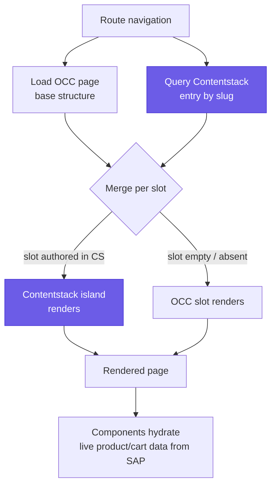
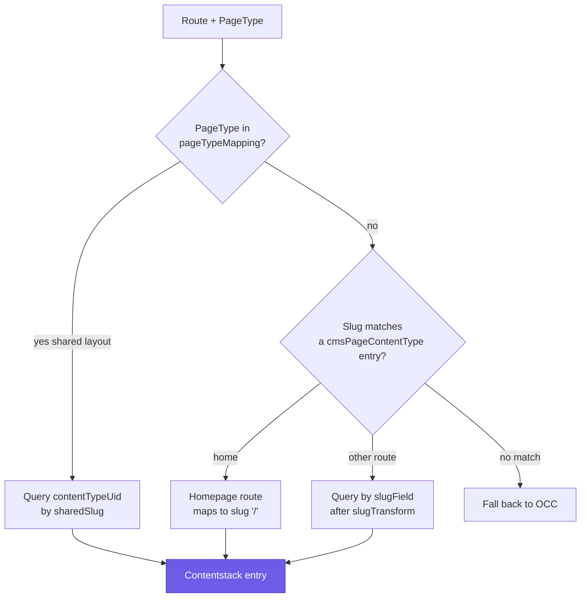
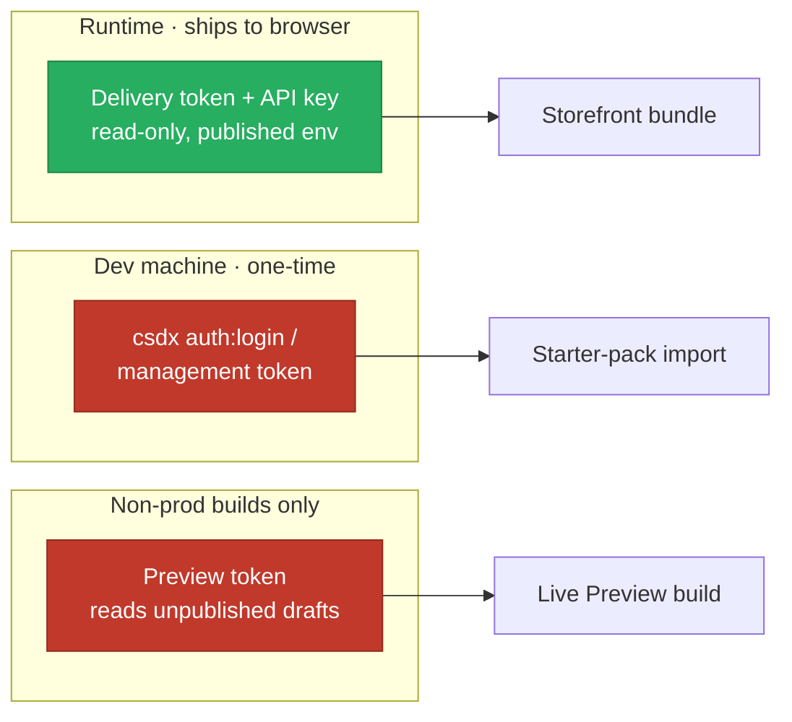

# Concepts

The mental model behind the connector. Read this before [architecture](architecture.md) or [content-model](content-model.md).

At its core, the connector answers one question at every render: **does Contentstack have content for this slot, and if so, use it — otherwise let SAP OCC fill it.** Everything below is a consequence of that single rule, plus the Angular dependency-injection mechanics that let a small feature library slot itself in front of Spartacus's stock CMS adapters without forking Spartacus.

The four ideas you must internalize:

1. **Hybrid by default** — OCC is the base page; Contentstack overrides only what you author.
2. **The slot is the unit of control** — you author into named template positions, not free-form pages.
3. **Last provider wins** — the connector must be imported *after* the base Spartacus modules, or it silently does nothing.
4. **Two tokens, two audiences** — a read-only delivery token ships to the browser; the privileged import credential never leaves your dev machine.

---

## Hybrid rendering: OCC base, Contentstack islands

The connector runs in **hybrid** mode by default (`occFallback: true`):

- **SAP Commerce (OCC) is the base for every page.** The shell (header, nav, footer), functional pages (login, cart, checkout, order, track), and any unauthored slot render from SAP exactly as they do today.
- **Contentstack overrides only the slots you author.** Author a slot → it becomes an "editable Contentstack island" over the OCC base. Leave it → OCC fills it.

The result: a fully working storefront where you manage just the marketing/editorial content headlessly. Commerce (products, cart, checkout, users) stays in SAP and hydrates live at render time.

Concretely: for a given route the page adapter loads the OCC page structure *and* queries Contentstack for a matching entry. The two `CmsStructureModel`s are merged slot-by-slot — a slot the Contentstack entry authored replaces the OCC slot of the same SAP position; a slot the entry left empty keeps its OCC components. This is why you can ship a homepage that is "9 sections from SAP, 1 from Contentstack" without re-authoring the nine.


*Hybrid merge: every route starts from the OCC base; Contentstack replaces only the slots it authored, and commerce data always hydrates from SAP.*

> [!NOTE]
> The alternative is **full-replacement** mode (`occFallback: false`), where an unauthored page/slot is *not* backfilled from OCC — a route absent from Contentstack renders as not-found. Hybrid is the recommended default; reach for full-replacement only when Contentstack is the sole CMS of record for the whole storefront.

A useful sanity check when hybrid is working: open DevTools → Network on an authored page and you will see **both** `cdn.contentstack.io` (the CMS content) **and** `/occ/v2/...` (the base page plus live commerce). Seeing only OCC traffic means the override never engaged — jump to [DI ordering: last provider wins (and fails silently)](#di-ordering-last-provider-wins-and-fails-silently).

---

## The slot is the unit of control

**Slot names are not arbitrary** — they are Spartacus's template **positions**, defined by the storefront's `LayoutConfig`. A slot only renders if its template declares it.

- You author a **lowercase `snake_case` field** in Contentstack (e.g. `section1`).
- The connector maps it to the **PascalCase SAP position** (e.g. `Section1`) via `SLOT_FIELD_TO_SAP_NAME` in [`src/cms/model/slot-maps.ts`](../src/cms/model/slot-maps.ts).

Because a component only shows when the SAP page template renders its slot, you must author into slots the active template actually declares. See the slot reference in [Slot reference](content-model.md#slot-reference).

### Why the case mismatch exists

Contentstack enforces lowercase `snake_case` uids (`^[a-z][a-z0-9_]*$`) for every field and content type. SAP Spartacus keys slots by their `PascalCase` position names (`Section2A`, `PlaceholderContentSlot`) and components by their `PascalCase` typecodes (`SimpleResponsiveBannerComponent`). The content-model translator lowercased both directions on import, and the connector maps them back at render time. Two small pure functions in `slot-maps.ts` do the work, both with an **identity fallback** so an unmapped name passes through unchanged:

- `toSlotName('section2_a')` → `'Section2A'`
- `toTypeCode('simple_responsive_banner_component')` → `'SimpleResponsiveBannerComponent'`

A representative slice of `SLOT_FIELD_TO_SAP_NAME`:

| Contentstack field uid | SAP position |
|---|---|
| `section1` | `Section1` |
| `section2_a` | `Section2A` |
| `placeholder_content_slot` | `PlaceholderContentSlot` |
| `navigation_bar` | `NavigationBar` |
| `footer` | `Footer` |

### Author only into positions the template renders

A component appears **only if** the SAP page template renders its slot. `LandingPage2Template` renders `Section1`, `Section2`, `Section2A/2B/2C`, and `Section3`–`Section5`, where `Section2A/2B/2C` are narrow one-third-width columns. So full-width hero content belongs in `Section1`, `Section2`, or `Section3`–`Section5`; authoring it into `Section2A` will render, but in a 1/3 column. To discover the exact positions any page exposes, inspect the live OCC page for `<cx-page-slot position="…">`, or read `contentSlot.position` from `GET /occ/v2/<site>/cms/pages`.

### Adding a slot beyond the shipped set

There is no connector-side cap on slots. To add one, three small additions line up (see [content-model](content-model.md)):

1. **Storefront** — declare `<cx-page-slot position="MyPromoStrip">` and its `LayoutConfig` entry.
2. **Connector config** — `additionalSlotFields: { my_promo_strip: 'MyPromoStrip' }`. This is merged over the built-in map by `effectiveSlotMap()`; custom entries win on key collisions.
3. **Content type** — add a `my_promo_strip` reference field to the page content type.

---

## Content types map to SAP typecodes

Each Contentstack **content type uid** maps to a SAP **typeCode** (e.g. `simple_responsive_banner_component` → `SimpleResponsiveBannerComponent`). The normalizer emits that typeCode, and Spartacus's `CmsConfig.cmsComponents` map resolves it to an Angular component.

- The editorial starter-pack types map to **stock** Spartacus components automatically — no `cmsComponents` config needed.
- You only add a `cmsComponents` entry for **your own** custom components. The map key **must equal** the emitted typeCode exactly (a custom content type not in the slot map falls back to its raw uid).

The mapping table lives in `TYPECODE_MAP` in [`src/cms/model/slot-maps.ts`](../src/cms/model/slot-maps.ts). A few entries worth knowing:

| Contentstack content type uid | SAP typeCode |
|---|---|
| `simple_responsive_banner_component` | `SimpleResponsiveBannerComponent` |
| `product_carousel_component` | `ProductCarouselComponent` |
| `cms_paragraph_component` | `CMSParagraphComponent` |
| `category_navigation_flat` | `CategoryNavigationComponent` |
| `footer_navigation_flat` | `FooterNavigationComponent` |

Two special cases the source encodes:

- **Flex components.** For a `CMSFlexComponent`, Spartacus selects the Angular component by the authored `flex_type` (e.g. `ProductIntroComponent`), not by the typeCode. `resolveFlexType()` returns `flex_type` for `CMSFlexComponent` and the plain typeCode for everything else, so the page normalizer and the field mapper can't drift.
- **Author-named blocks without a `type_code`.** If a block has no explicit `type_code` field, `componentTypeMapping` (block uid → SAP typeCode) lets the app supply one without editing content.

---

## References, not Modular Blocks

Slots are **multi-reference fields**. The connector resolves the referenced component entries inline via the Delivery SDK's `includeReference`. Contentstack **Modular Blocks** (inline composed blocks) are **not** read — model components as separate content types referenced from the page or shell.

The `includeReferences` config controls which reference fields are expanded (defaults to all page slot + header/footer fields). Nested references — like a banner's own `media_container` — need their full path added explicitly. See [Media Container](content-model.md#media-container-resolving-a-nested-reference).

### Why references and not Modular Blocks

Two reasons, both structural:

1. **Reuse.** A component authored as its own entry (a banner, a carousel) can be referenced from many pages and edited once. Modular Blocks are inline to a single entry — no reuse, no independent lifecycle.
2. **The normalizer reads references.** The page normalizer walks each slot's resolved reference entries and emits a Spartacus component per entry. It does not descend into Modular Block structures, so content modeled that way is simply invisible to the pipeline.

The default expand list is built in `slot-maps.ts` as `PAGE_REFERENCE_FIELDS` — every slot field plus `header`/`footer`, and for each one it *also* pre-adds the `<field>.media_container` path. That is why banners placed directly in a slot resolve their image set out of the box. A reference nested one level deeper than the default expects still needs its explicit path — for example a `media_container` referenced from *inside* a banner that itself sits in a non-default slot. Without the include path, the field round-trips as an unexpanded `{ uid, _content_type_uid }` stub, `isMediaContainer()` returns `false`, and the banner normalizer silently falls back to its direct per-breakpoint `media_*` file fields (harmless, just not what you authored).

The Delivery API caps reference-expansion depth (plan-gated). The connector's navigation model sidesteps this by modeling menus as a **flat adjacency list** (`nav_node_flat` — an `all_nodes` pool plus a text `parent_id`) reassembled into a tree in code, so the include chain stays shallow and constant no matter how deep the menu.

---

## Page-type resolution

- **Per-route content/landing pages** (including the homepage) resolve against a single `cmsPageContentType`, queried by slug. The starter pack authors the home as `landing_page`.
- **Shared-layout pages** (product detail, category/list) use `pageTypeMapping` to point a `PageType` at its own `contentTypeUid` and a `sharedSlug` — one shared entry serves every PDP/PLP, and product/facet data always come from OCC.
- **Unmapped page types fall back to OCC.**

The homepage is special: the connector resolves Spartacus's homepage route to the slug `/`, so the home entry's slug field must be exactly `/`. When OCC's route and the CMS slug don't match byte-for-byte (locale/category prefixes, etc.), use `slugTransform` to rewrite the route before querying rather than reauthoring entries. See [troubleshooting](troubleshooting.md).


*Page-type resolution: shared-layout types resolve by a fixed `sharedSlug`, per-route pages by their (optionally rewritten) slug, and anything unmatched falls back to OCC.*

The `sharedSlug` mechanism is worth spelling out. A product page sets `slugField: 'page_type'` + `sharedSlug: 'ProductPage'` and one entry authored with `page_type = 'ProductPage'` serves **every** SKU — the connector never derives a per-SKU slug from the route, so `slugTransform` has nothing to act on for shared-slug pages and is ignored there. The SKU-specific price, stock, and add-to-cart still come from OCC. Serving multiple *distinct per-route* content types (beyond the single `cmsPageContentType`) is not supported yet; those page types fall back to OCC.

---

## The two-token security model

| Token | Used where | Nature |
|---|---|---|
| **Delivery token** (+ API key) | The storefront, at runtime | Read-only; safe in the client bundle. |
| **`csdx auth:login`** (or a scoped management token) | Your dev machine, one-time content-model import | Privileged; never committed, never shipped. |
| **Preview token** | Non-production Live Preview builds only | **Secret** — grants read access to unpublished drafts; keep out of committed source. |

The storefront only ever uses the read-only delivery token. The privileged credential exists solely for the one-time starter-pack import. See [Provision the content model](installation.md#step-2-provision-the-content-model-demo-seed-csdx).


*Three credentials, three audiences: only the read-only delivery token ships to the browser; the import credential and the preview token never leave trusted, non-production contexts.*

Key hygiene points, grounded in the config and getting-started guides:

- **`apiKey` + `deliveryToken` are read-only** and scoped to a publishing environment. They are meant to be in the client bundle; that is normal and safe.
- **The management/`csdx` credential is privileged** — it can write the content model. It is used once, on your machine, to import the starter pack (`csdx cm:stacks:import`). Never commit it, never ship it.
- **The `previewToken` is a secret.** It is emitted by `ng add` *only* when you enable Live Preview, and it grants read access to *unpublished* drafts. Keep it out of committed source (`.env*` is gitignored; you can gitignore the real credentials file or swap it per build via Angular `fileReplacements`). The connector additionally **refuses to activate Live Preview in production mode**, so a stray preview build can't leak drafts to end users.

---

## DI ordering: last provider wins (and fails silently)

The connector overrides Spartacus's abstract `CmsPageAdapter` / `CmsComponentAdapter` tokens and relies on Angular DI's **last-provider-wins** rule. `ContentstackCmsFeatureModule` must be imported **after** the base Spartacus modules (which include `CmsOccModule`).

```mermaid
flowchart TD
  subgraph RIGHT[Correct · connector imported last]
    R1[Base Spartacus modules<br/>provide OCC adapters] --> R2[ContentstackCmsFeatureModule<br/>provides CS adapters]
    R2 --> R3[CS adapter wins DI]
    R3 --> R4[Content from Contentstack]
  end
  subgraph WRONG[Wrong · connector imported too early]
    W1[ContentstackCmsFeatureModule<br/>provides CS adapters] --> W2[Base Spartacus modules<br/>provide OCC adapters]
    W2 --> W3[OCC adapter wins DI]
    W3 --> W4[Pages stay on OCC<br/>no error thrown]
  end
  classDef cs fill:#6C5CE7,color:#ffffff,stroke:#4834d4
  classDef bad fill:#c0392b,color:#ffffff,stroke:#922b21
  class R3,R4 cs
  class W3,W4 bad
```


*Angular DI keeps the last provider for a token: importing the connector after the base modules makes the Contentstack adapter win; importing it too early leaves the OCC adapter in front, and the integration silently no-ops.*

> [!WARNING]
> If the feature module is imported *before* the base modules — or omitted — the OCC adapters win the DI race, pages keep rendering from SAP OCC, and **no error is thrown**. The integration simply does nothing. If content isn't coming from Contentstack, check import ordering first. See [Module composition and DI ordering](architecture.md#module-composition-and-di-ordering) and [troubleshooting](troubleshooting.md).

In a standard `ng add @spartacus/schematics` app, the safe place is **last** in `SpartacusFeaturesModule` (or after `StorefrontModule`):

```ts
@NgModule({
  imports: [
    // ...existing Spartacus feature/OCC modules stay as-is...
    ContentstackCmsFeatureModule, // <-- add last
  ],
})
export class SpartacusFeaturesModule {}
```

The `ng add` schematic places the import for you; the ordering rule only bites when wiring the module by hand.

---

## Eager, not lazy

`ContentstackCmsFeatureModule` **eagerly** imports the CMS adapter override and Live Preview modules — the adapter resolves the very first page at bootstrap, and the Live Preview decorator is consulted as components render. The standard lazy `CmsConfig.featureModules` gate is deliberately not used (it only fires for a feature-tagged `cmsComponents` entry, which this library never registers).

The history matters because it is a real bug the source comments call out. Both submodules were once placed behind a lazy `CmsConfig.featureModules` entry — the standard Spartacus code-splitting convention. But that gate only fires when a `cmsComponents` component *tagged with the feature* renders, and the connector registers no such component. So the entry never loaded, the CMS override never installed, and the whole integration was inert. The fix, visible in `contentstack-cms-feature.module.ts`, is a plain eager `imports: [ContentstackCmsModule, ContentstackLivePreviewModule]`:

- `ContentstackCmsModule` **must** be eager because the adapter has to be in the DI graph *before* the first page request at bootstrap — there is no later component render to trigger a lazy load.
- `ContentstackLivePreviewModule` is eager for the same structural reason: Spartacus's `ComponentDecorator` extension point is consulted as components render, and the Live Preview SDK only actually initializes when `delivery.livePreview` is set — so it stays inert on normal delivery builds and activates only on preview builds.

The module also registers `defaultContentstackConfig` as default config (so the app only supplies credentials), binds `ContentstackConfig` to Spartacus's merged `Config`, and provides a **core-only** `CONTENTSTACK_CURRENT_USER` (login state only, via `@spartacus/core`'s `AuthService`). Role-level gating requires the app to override that token with the real user from `@spartacus/user` — keeping `@spartacus/user` an app concern, never a connector dependency. It deliberately does **not** import `SmartEditRootModule` (the primary SmartEdit bypass) and registers **no** `cmsComponents` mappings (that is app-specific).

---

## Related

- [architecture](architecture.md) — the concrete override chain and normalizer pipeline
- [content-model](content-model.md) — slots, content types, and the seed
- [configuration](configuration.md) — every knob these concepts expose
