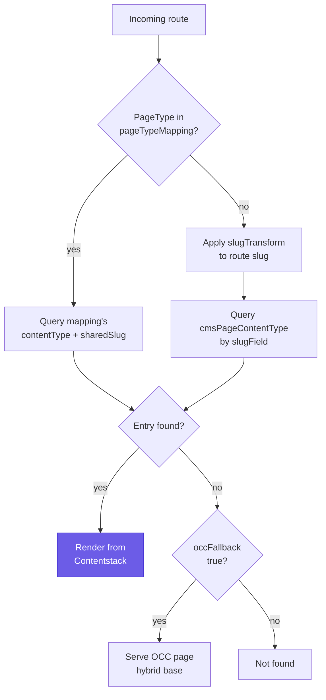

# Configuration

Every option lives on the `ContentstackConfig` class ([`src/config/contentstack-config.ts`](../src/config/contentstack-config.ts)) and is **fully typed** — because the library augments Spartacus's `Config`, your editor autocompletes and type-checks the whole `provideConfig(<ContentstackConfig>{ contentstack: … })` block, with each field's JSDoc on hover.

```ts
provideConfig(<ContentstackConfig>{
  contentstack: {
    delivery: { /* connection & credentials */ },
    /* behavior options */
    accessControl: { /* opt-in content gating */ },
  },
})
```

The whole config is a single optional `contentstack` object. Only `delivery.apiKey`, `delivery.deliveryToken`, and `delivery.environment` are truly required — everything else has a shipped default (see [Defaults](#defaults)) that deep-merges under whatever you provide, because the defaults are registered with `provideDefaultConfig` in `ContentstackCmsFeatureModule` and your `provideConfig` overrides merge on top. The three top-level shapes below map 1:1 to the three sub-objects in the class:

- `contentstack.delivery` — how the connector reaches the Delivery API (credentials, region, branch, Live Preview).
- `contentstack.*` — the behavior options that decide how routes resolve to content and how content maps onto Spartacus slots.
- `contentstack.accessControl` — opt-in, presentation-level content gating.

> [!NOTE]
> Type augmentation lives at the bottom of the config file: `declare module '@spartacus/core' { interface Config extends ContentstackConfig {} }`. That is why `provideConfig`/`provideDefaultConfig` accept the Contentstack slice with full type-safety, exactly like any other Spartacus config slice.

---

## `contentstack.delivery` connection credentials

| Option | Required | Default |
|---|---|---|
| `apiKey` | yes | — |
| `deliveryToken` | yes | — |
| `environment` | yes | — |
| `region` | | `Region.US` |
| `branch` | | `main` |
| `livePreview` | | `false` |
| `previewToken` | when `livePreview` | — |
| `previewHost` | | US preview host |

This whole object feeds straight into `contentstack.stack(...)` when the delivery client is built. Per-option detail:

- **`apiKey`** — `string`, required. Your **Stack API key**. Identifies which stack the storefront reads from.
- **`deliveryToken`** — `string`, required. A **delivery token scoped to `environment`**. Read-only; grants access to published content in that environment only.
- **`environment`** — `string`, required. The **publishing environment name** (e.g. `production`, `development`). Only content published to this environment is returned.
- **`region`** — `Region` (from `@contentstack/delivery-sdk`), default `Region.US`. Selects the **data-center region** so the SDK talks to the right host. Use the enum member that matches where your stack lives (`Region.US`, `Region.EU`, `Region.AZURE_NA`, …), not a raw string.
- **`branch`** — `string`, default `main`. Optional [Contentstack branch](https://www.contentstack.com/docs/developers/create-branches) to read from. Point a preview/staging build at a non-`main` branch without touching production content.
- **`livePreview`** — `boolean`, default `false`. When `true`, the delivery stack is built with **Contentstack Live Preview enabled** (draft content served from the preview host) and the Live Preview SDK initializes in the storefront so Visual Builder edits update live. Requires `previewToken`. Use a **preview-specific build** — a normal production build should leave this `false`. See [live-preview](live-preview.md).
- **`previewToken`** — `string`, required when `livePreview` is `true`. The **Live Preview preview token**, distinct from `deliveryToken`; the SDK uses it to fetch draft content from the preview host.
- **`previewHost`** — `string`, default `rest-preview.contentstack.com` (US). Set the **region-matching preview host** for EU/Azure/GCP stacks so preview traffic hits the correct data center.

Where to get the credentials:

| Value | Where |
|---|---|
| `apiKey` | Settings → Stack settings → **API Key** |
| `deliveryToken` | Settings → Tokens → **Delivery Tokens** (scope it to your environment) |
| `environment` | your publishing environment, e.g. `development` |
| `region` | your stack's data center (`Region.US` / `EU` / `AZURE_NA` / …) |

A minimal, working `delivery` block:

```ts
delivery: {
  apiKey: 'blt•••••••••••',
  deliveryToken: 'cs•••••••••••',
  environment: 'development',
  region: Region.US,      // optional — this is the default
  branch: 'main',         // optional — this is the default
}
```

> [!INFO]
> **Secret hygiene.** `apiKey` + `deliveryToken` are read-only and safe in the client bundle. A `previewToken` (Live Preview only) is a **secret** — keep it out of committed source; `.env*` is gitignored, and you can gitignore the real credentials file or swap it per build via Angular `fileReplacements`.

---

## `contentstack` — behavior

| Option | Default / note |
|---|---|
| `cmsPageContentType` | Page content type queried by slug. Default `cms_page`. |
| `slugField` | `url` — field holding the page slug. |
| `slugTransform` | `{ pattern, replacement }` regex rewrite of the route slug before querying. |
| `localeMapping` | Site isocode → Contentstack locale (e.g. `{ en: 'en-us' }`); identity fallback. |
| `includeFallback` | `false` — request master-locale fallback for unlocalized entries. |
| `occFallback` | `true` — hybrid (OCC base + CS overrides); `false` = full-replacement. |
| `globalSlots` | `{ contentType, title? }` — shared shell merged into every page. |
| `pageTypeMapping` | Per-`PageType` `{ contentTypeUid, slugField?, sharedSlug? }` (shared-layout pages). |
| `additionalSlotFields` | Extra `{ fieldUid: 'SapSlotPosition' }` beyond the built-in slot map. |
| `componentContentType` | Content type for standalone component lookups (else components ship in pages). |
| `componentTypeMapping` | Block uid → SAP typeCode (for author-named blocks without a `type_code`). |
| `includeReferences` | Reference fields to expand; defaults to all slot + header/footer fields. |
| `accessControl` | Presentation-level gating — see below and [access-control](access-control.md). |
| `timeoutMs` | `10000` — Delivery API call timeout. |

Per-option detail, grounded in the class JSDoc:

- **`cmsPageContentType`** — `string`, default `cms_page`. The content type uid whose entries model **CMS pages**; the page adapter queries this content type by slug to resolve a route. The starter/import seed ships a `cms_page` content type, so the default works out of the box.
- **`slugField`** — `string`, default `url`. The **field uid that holds the page URL/slug** on page content types. Can be overridden per page type via `pageTypeMapping[...].slugField`.
- **`slugTransform`** — `{ pattern: RegExp; replacement: string }`, no default. A **regex rewrite applied to the route slug** (`PageContext.id`) before it is queried against `slugField`, via `slug.replace(pattern, replacement)` (same semantics as `String.replace`). Use it when OCC's route and the CMS entry's authored slug don't match byte-for-byte — a locale/category prefix OCC includes but the entry omits, differing separators, and so on. Only applies to **per-route content pages**; page types resolved via `pageTypeMapping[...].sharedSlug` use that fixed value directly and are never route-derived, so a rewrite has nothing to act on there.
  ```ts
  // Strip a leading locale segment: /en/about-us -> /about-us before the query
  slugTransform: { pattern: /^\/en\//, replacement: '/' }
  ```
- **`localeMapping`** — `Record<string, string>`, no default. Maps a Spartacus **site language isocode** (what `LanguageService.getActive()` emits, e.g. `en`, `de`) to the **Contentstack locale code** content is authored in (e.g. `en-us`, `de-de`). Resolved before querying, so storefront language codes and stack locale codes need not be identical. **Identity fallback**: an isocode with no entry is passed through unchanged; omit it (or leave `{}`) when your isocodes already match the locale codes. Example: `{ en: 'en-us', de: 'de-de' }`.
- **`includeFallback`** — `boolean`, default `false`. When `true`, Delivery API queries request Contentstack's `include_fallback` behavior (delivery-sdk `.includeFallback()`): an entry not localized in the active non-master locale **falls back to its master-locale content** instead of returning empty. Only applied when a locale is actually resolved (see `localeMapping`); with no locale the stack already serves master, so it is a no-op. Default `false` gives strict per-locale content.
- **`occFallback`** — `boolean`, default `true`. The switch between **hybrid** and **full-replacement** rendering. When `true`, the SAP OCC page is loaded as the base for every route and Contentstack overrides only the slots it authors — shell, nav, footer, and pages like login/cart/checkout/order fall back to OCC so the storefront runs end-to-end. When `false`, Contentstack is the sole CMS and a route absent from Contentstack renders as not-found. See [hybrid rendering](concepts.md#hybrid-rendering-occ-base-contentstack-islands).
- **`globalSlots`** — `{ contentType: string; title?: string }`, no default. **Shared/global slots** (header, footer, navigation, logo, …) authored once and merged into every page. When set, the page adapter fetches this entry and merges its slots + components into each page's `CmsStructureModel`. `contentType` is the content type uid holding the shared slots (e.g. `global_slots`); `title` names the specific entry to load — omit it to load the first (typically singleton) entry. Omit the whole option if every page carries its own shell.
  ```ts
  globalSlots: { contentType: 'global_slots', title: 'Main shell' }
  ```
- **`pageTypeMapping`** — `Partial<Record<PageType, ContentstackPageTypeMapping>>`, no default. Maps a Spartacus `PageType` to the content type that models it. Each entry is a **`ContentstackPageTypeMapping`**:
  - `contentTypeUid` (`string`, required) — the content type uid that models this page type.
  - `slugField` (`string`, optional) — the slug field on that content type; defaults to the top-level `slugField`.
  - `sharedSlug` (`string`, optional) — for page types that use a **single shared layout** regardless of route code (product pages all share `ProductDetailsPageTemplate`; category pages all share `ProductListPageTemplate`), the fixed value to match on `slugField` instead of the route code. Author **one** entry and every SKU/category renders it while hydrating its own data from OCC. Omit for content pages (resolved per-slug by route). When a page type is not listed at all, the adapter treats it as a `ContentPage`.
  ```ts
  pageTypeMapping: {
    [PageType.PRODUCT_PAGE]: {
      contentTypeUid: 'product_page',
      slugField: 'page_type',
      sharedSlug: 'ProductPage',   // one entry serves every SKU
    },
  }
  ```
  See [Page-type resolution](concepts.md#page-type-resolution).
- **`additionalSlotFields`** — `Record<string, string>`, no default. Registers **custom slots beyond the shipped set**: Contentstack field uid → SAP slot **position** name (e.g. `{ my_promo_strip: 'MyPromoStrip' }`). Merged over the built-in slot map for content discovery. The slot still only renders if the storefront's template/`LayoutConfig` declares that position **and** the content type carries a matching reference field.
- **`componentContentType`** — `string`, no default. The content type uid used by the component adapter for **standalone component lookups** (`CmsComponentAdapter.load` / `findComponentsByIds`). The primary path delivers component data **embedded in the page payload** (the page normalizer emits `components[]`, loaded straight into the CMS store without the component adapter). This is only consulted when Spartacus requests a shared/reusable component by uid that is not already in the store. Leave unset if all components ship inside pages.
- **`componentTypeMapping`** — `Record<string, string>`, no default. Maps a **Contentstack block uid → Spartacus typeCode**, consulted by the page normalizer when a block has no explicit `type_code` field. Lets an app map author-named blocks to stock component types without editing content.
- **`includeReferences`** — `string[]`, defaults to every page slot + header/footer reference field (`PAGE_REFERENCE_FIELDS` from `slot-maps.ts`). The **reference field uids to expand** when fetching a page (Contentstack `includeReference`), so referenced modules resolve in a single call and the normalizer sees fully-expanded content. Add nested paths (e.g. `section1.media_container`) when a component references another content type — and **spread the defaults** so you don't drop the built-ins (see [Defaults](#defaults)). See [Media Container](content-model.md#media-container-resolving-a-nested-reference).
- **`accessControl`** — `ContentstackAccessControl`, presentation-level gating. Off by default; see [below](#contentstackaccesscontrol-opt-in-content-gating) and [access-control](access-control.md).
- **`timeoutMs`** — `number`, default `10000`. **Timeout (ms) applied to Delivery API calls.** Exposed so a CMS slow-down never hangs the storefront — the client service treats a timeout as a resilience event and (in hybrid mode) falls back to OCC.

### Notes on selected options

- **`occFallback`** — the switch between [hybrid](concepts.md#hybrid-rendering-occ-base-contentstack-islands) (`true`, default) and full-replacement (`false`). Leave it on unless you truly author every page.
- **`slugTransform`** — use it when OCC's route and the CMS-authored slug don't match byte-for-byte (locale/category prefixes). Rewrites the route before the query rather than reauthoring entries. See its JSDoc and [troubleshooting](troubleshooting.md).
- **`pageTypeMapping`** — points a `PageType` (e.g. product, category) at its own content type + `sharedSlug`. One shared entry serves every PDP/PLP. See [Page-type resolution](concepts.md#page-type-resolution).
- **`includeReferences`** — defaults to all page slot + header/footer fields. Add nested paths (e.g. `section1.media_container`) when a component references another content type. See [Media Container](content-model.md#media-container-resolving-a-nested-reference).
- **`localeMapping` / `includeFallback`** — see [content-model](content-model.md) and [Step 4 — Configure](installation.md#step-4-configure).

**How a route becomes content.** These options don't act in isolation — they combine, per route, to decide whether a page is served from Contentstack or falls back to OCC. The flow below traces one incoming route through that decision:



*How `pageTypeMapping`, `slugTransform`, `cmsPageContentType`, and `occFallback` together resolve a route to Contentstack content or an OCC fallback.*

---

## `contentstack.accessControl` opt-in content gating

| Option | Default |
|---|---|
| `enabled` | `false` |
| `accessField` | `access_tags` |
| `anonymousToken` | `_require-anonymous` |
| `loginToken` | `_require-login` |
| `rolePrefix` | `_require-` (role `b2badmingroup` → `_require-b2badmingroup`) |
| `gateSharedSlugPages` | `false` |

**Presentation-level content gating.** When `enabled`, entries carrying required audience/permission tokens in `accessField` are hidden from users who don't hold those tokens; tokens are derived from the current user's roles (via the `CONTENTSTACK_CURRENT_USER` token). Per-option detail:

- **`enabled`** — `boolean`, default `false`. Master switch. When off, every path behaves as if gating is absent, so existing installs are unaffected.
- **`accessField`** — `string`, default `access_tags`. Entry field uid holding the **required-token list** (a multi-value text field on the content type). An entry with **no tokens** (absent/empty) is public.
- **`anonymousToken`** — `string`, default `_require-anonymous`. Token granted to **anonymous** visitors.
- **`loginToken`** — `string`, default `_require-login`. Token granted to **any logged-in** user.
- **`rolePrefix`** — `string`, default `_require-`. Prefix applied to each of the user's role ids to form a permission token (role `b2badmingroup` → `_require-b2badmingroup`). Only entry tokens **starting with this prefix** are enforced; others are ignored.
- **`gateSharedSlugPages`** — `boolean`, default `false`. Whether to apply page-level gating to shared-slug product/category layouts. Off by default because one shared entry would gate every SKU/category at once, which is rarely intended (real product data comes from OCC regardless).

> [!WARNING]
> **Not a security boundary.** Gated entries are still fetched from the Delivery API (the delivery token ships in the client bundle) and dropped **before render**, so a determined user can still read them via the API/devtools. Use it to tailor **what the UI shows**, not to protect confidential data.

Full behavior, the `CONTENTSTACK_CURRENT_USER` wiring for role-level gating, and the SSR-caching caveats are in [access-control](access-control.md).

---

## Defaults

The shipped defaults live in [`src/config/default-contentstack-config.ts`](../src/config/default-contentstack-config.ts) (exported as part of the public API, e.g. `defaultContentstackConfig`). They are registered with `provideDefaultConfig` in `ContentstackCmsFeatureModule`, so any app-level `provideConfig` **deep-merges over** them. The shipped values:

| Option | Default |
|---|---|
| `delivery.apiKey` / `deliveryToken` / `environment` | `''` (you must supply) |
| `delivery.region` | `Region.US` |
| `delivery.branch` | `main` |
| `delivery.livePreview` | `false` |
| `slugField` | `url` |
| `occFallback` | `true` |
| `includeFallback` | `false` |
| `cmsPageContentType` | `cms_page` |
| `includeReferences` | every `cms_page` slot + header/footer field (`PAGE_REFERENCE_FIELDS`) |
| `timeoutMs` | `10000` |
| `accessControl.enabled` | `false` |
| `accessControl.accessField` | `access_tags` |
| `accessControl.anonymousToken` | `_require-anonymous` |
| `accessControl.loginToken` | `_require-login` |
| `accessControl.rolePrefix` | `_require-` |
| `accessControl.gateSharedSlugPages` | `false` |

Credentials are intentionally blank — the consuming app must provide `apiKey` / `deliveryToken` / `environment` via its own `provideConfig`. Because config merges are shallow-per-key over arrays, **spread the defaults when extending array options** so you don't drop the built-ins:

```ts
includeReferences: [
  ...defaultContentstackConfig.contentstack.includeReferences!,
  'section1.media_container',
]
```

---

## Related

- [Step 4 — Configure](installation.md#step-4-configure) — the minimal working config
- [content-model](content-model.md) — the content the config points at
- [live-preview](live-preview.md) — enabling `livePreview` + `previewToken`
- [access-control](access-control.md) — the full gating story
