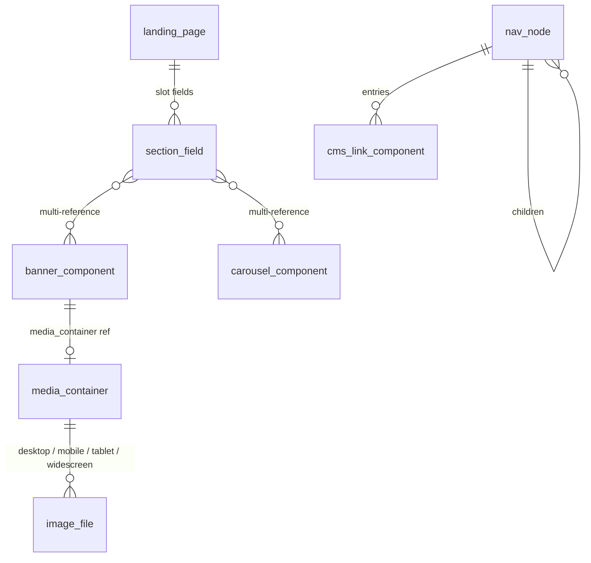
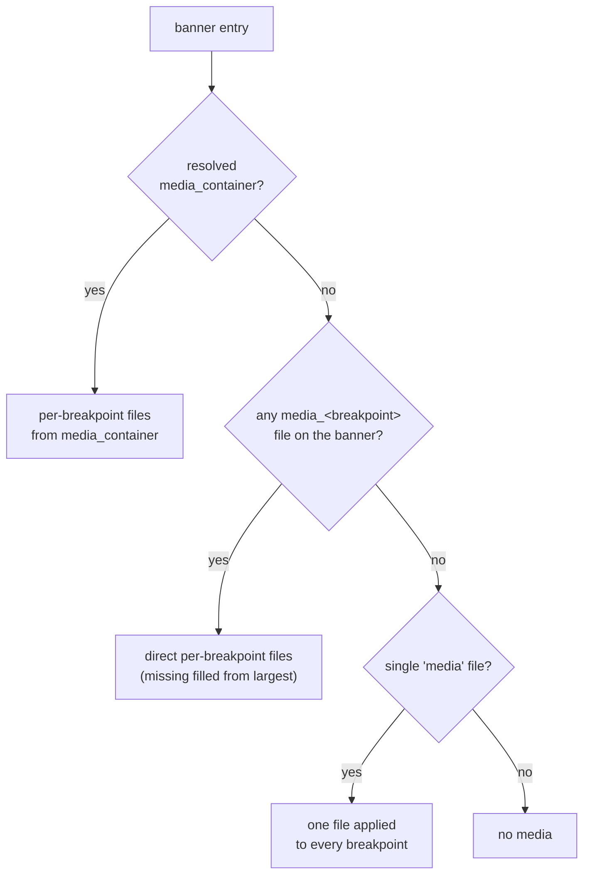
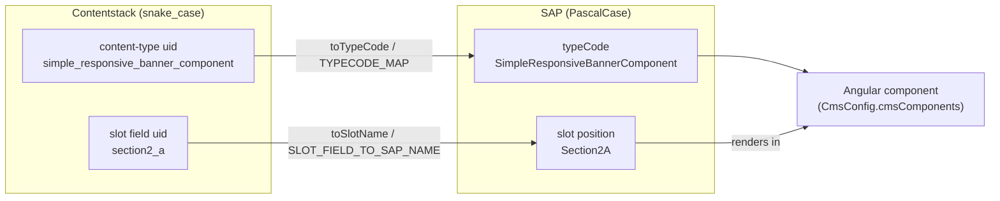

# Content Model

Reference for the content types and slots you author in Contentstack. The starter pack in [`import-export/starter-pack/`](../import-export/starter-pack) provisions this model into a stack; this mirrors the repository's [`CONTENT-MODEL.md`](../CONTENT-MODEL.md).

---

## The authoring model (hybrid recap)

The connector renders **SAP Commerce (OCC) as the base for every page** and lets Contentstack **override only the slots you author** — "editable Contentstack islands within the SAP page." So the content model only needs to cover the **content you actually manage headlessly** (home hero, promos, landing/content pages, shell if you take it over) — *not* the entire storefront. The shell, functional pages (login/cart/checkout/order/track), and any unauthored slot come from OCC automatically.

**Unit of control = the slot.** Author a slot → it's a Contentstack island; leave it → OCC fills it. See [The slot is the unit of control](concepts.md#the-slot-is-the-unit-of-control).

This has a direct consequence for the model: **you never have to reproduce SAP's full CMS schema.** A production stack often ships only a handful of content types — two banner types, a carousel, a paragraph, a link, a media container, and one page type — and still overrides everything a marketing team touches. Everything the connector cannot resolve from Contentstack degrades to OCC rather than erroring, so a small, incomplete model is a *valid* model.

---

## Slot reference

Slot names are **not arbitrary** — they are Spartacus's template **positions**, defined by the storefront's `LayoutConfig`. A slot only renders if its template declares it. You author a **lowercase field** in Contentstack; the connector maps it to the **PascalCase SAP position**.

| SAP template (page type) | SAP slot positions | Contentstack field uid |
|---|---|---|
| **Shell** (header/footer, every page) | `SiteLogo`, `SearchBox`, `MiniCart`, `NavigationBar`, `SiteContext`, `SiteLinks`, `HeaderLinks`, `Footer` | `site_logo`, `search_box`, `mini_cart`, `navigation_bar`, `site_context`, `site_links`, `header_links`, `footer` |
| **LandingPage2Template** (home/landing) | `Section1`, `Section2`, `Section2A`, `Section2B`, `Section2C`, `Section3`, `Section4`, `Section5` | `section1`, `section2`, `section2_a`, `section2_b`, `section2_c`, `section3`, `section4`, `section5` |
| **ContentPage1Template** (FAQ, terms, …) | `Section1`, `Section2A/B/C`, `Section3`, `BodyContent`, `SideContent` | `section1`, `section2_a/b/c`, `section3`, `body_content`, `side_content` |
| **ProductDetailsPageTemplate** (PDP) | `Summary`, `UpSelling`, `CrossSelling`, `Tabs`, `PlaceholderContentSlot` | `summary`, `up_selling`, `cross_selling`, `tabs`, `placeholder_content_slot` |
| **ProductListPageTemplate** (PLP/category/search) | `ProductLeftRefinements`, `ProductGridSlot`, `ProductListSlot`, `SearchResultsGridSlot` | `product_left_refinements`, `product_grid_slot`, `product_list_slot`, `search_results_grid_slot` |
| **CartPageTemplate** | `TopContent`, `CenterRightContentSlot`, `EmptyCartMiddleContent` | `top_content`, `center_right_content_slot`, `empty_cart_middle_content` |

The full mapping lives in [`src/cms/model/slot-maps.ts`](../src/cms/model/slot-maps.ts) → `SLOT_FIELD_TO_SAP_NAME`. That table is the connector's **slot allowlist**: on every page fetch the page normalizer only treats a Contentstack field as a slot if its uid is a key in this map (plus any [custom slots](#custom-slots-unlimited) you register). The map ships more positions than the six templates above list — for example `bottom_header_slot` → `BottomHeaderSlot`, `middle_content` → `MiddleContent`, `left_content_slot` → `LeftContentSlot` — so most stock Spartacus positions already resolve without extra config.

> [!NOTE]
> `LandingPage2Template` renders `Section1`, `Section2`, `Section2A/2B/2C`, and `Section3`–`Section5`. `Section2A/2B/2C` are narrow 1/3-width columns, so full-width content belongs in the full-width sections (`Section1`, `Section2`, `Section3`–`5`).

**How to discover the slots for any page** (since OCC already renders it):
1. Inspect the live page — `<cx-page-slot position="Section1">` — the `position` is the slot name.
2. `GET /occ/v2/<site>/cms/pages?...` → each `contentSlot.position`.
3. SmartEdit / Backoffice slot labels.

Whichever you use, take the exact PascalCase position and snake_case it for the Contentstack field uid (`Section2A` → `section2_a`, `CenterRightContentSlot` → `center_right_content_slot`). `toSlotName()` reverses that at render time; an uid it doesn't recognize falls through to itself, so a typo produces an SAP position that no template declares — the slot simply won't render, rather than erroring.

---

## Content types — self-documenting, per-template

Principle: instead of one giant `cms_page` with every slot field, ship **one page content type per template**, exposing **only that template's slot fields**, each with a friendly display name and help text. Editors then see only relevant, labelled fields.


*A page content type exposes slot fields; each slot field multi-references reusable component types, banners nest a `media_container`, and navigation is a self-referencing tree of `nav_node` with `cms_link_component` leaves.*

### Page content types

Common fields on every page type: `title` (required), `url` (slug), `page_type`, `template`. Each **slot field is a multi-reference** to the component content types below. A slot field being *multi*-reference is deliberate — a single slot can stack several components (e.g. a banner **and** a paragraph in `Section1`), and the page normalizer preserves their authored order when it builds the slot's component list.

| Content type (uid) | Template | Slot fields (reference) |
|---|---|---|
| `landing_page` | LandingPage2Template | `section1`, `section2`, `section2_a`, `section2_b`, `section2_c`, `section3`, `section4`, `section5` |
| `content_page` | ContentPage1Template | `section1`, `section2_a`, `section2_b`, `section2_c`, `section3`, `body_content`, `side_content` |
| `product_page` | ProductDetailsPageTemplate | `summary`, `up_selling`, `cross_selling`, `tabs`, `placeholder_content_slot` |
| `category_page` | ProductListPageTemplate | `product_left_refinements`, `product_grid_slot`, `product_list_slot`, `search_results_grid_slot` |
| `global_slots` | shell (merged into every page) | `site_logo`, `search_box`, `mini_cart`, `navigation_bar`, `site_context`, `site_links`, `header_links`, `footer` |

The page entry also carries two single references, `header` and `footer` (to `cms_header` / `cms_footer`), which the connector expands alongside the slot fields — see [`ContentstackCmsPageEntry`](../src/cms/model/contentstack.model.ts). The `global_slots` entry is layered into *every* page's shell rather than resolved per-route, so its positions (`SiteLogo`, `Footer`, …) show up on the home page and the cart page alike.

Help-text pattern per slot field, e.g. on `landing_page.section1`:
> *"Top hero band (SAP slot `Section1`). Add a banner/carousel to override just this section; leave empty to keep SAP's."*

Naming every field after its SAP position in the help text is what makes the model self-documenting — an editor opening `content_page` sees `body_content` and `side_content` with descriptions rather than a wall of generic slot fields.

### Component content types (the reusable blocks)

| Content type (uid) → SAP typeCode | Key fields |
|---|---|
| `simple_responsive_banner_component` → SimpleResponsiveBannerComponent | `title`, `url_link`, `media_container` (→media_container), `media`, `media_mobile`, `media_tablet`, `media_desktop`, `media_widescreen` (file) |
| `simple_banner_component` → SimpleBannerComponent | `title`, `url_link`, `media_container` (→media_container), `media*` |
| `media_container` → MediaContainer | `title`, `desktop`, `mobile`, `tablet`, `widescreen` (file) — a reusable image set referenced from a banner's `media_container` field |
| `product_carousel_component` → ProductCarouselComponent | `title`, `products` (multi-value text: OCC product-URL strings) |
| `cms_paragraph_component` → CMSParagraphComponent | `title`, `content` (multiline/rich text) |
| `cms_tab_paragraph_component` → CMSTabParagraphComponent | `title`, `content` — same shape/renderer as `cms_paragraph_component`; SAP tracks it as a distinct type |
| `cms_link_component` → CMSLinkComponent | `title`, `link_name`, `url`, `target` |
| `cms_flex_component` → CMSFlexComponent | `title`, `flex_type` |
| `cms_tab_paragraph_container` → CMSTabParagraphContainer | `title`, `component_uid` (optional stable id), `tab_components` (multiline text: JSON array of `{uid, type_code}`) — a tab strip whose panels hydrate **from OCC by component id** |
| `nav_node_flat` (+ `category_navigation_flat`, `footer_navigation_flat`, `navigation_component`) | nav tree (authoring view — actual delivery is a flat `parent_id`/`sort_order` pool, see below): `uid_val`, `title`, `children`, `entries` (→cms_link_component) |

Every uid → typeCode pair above is defined in [`slot-maps.ts`](../src/cms/model/slot-maps.ts) → `TYPECODE_MAP`, and `toTypeCode()` performs the lookup (with an identity fallback for custom types). The typeCode matters because Spartacus selects the Angular component to render by it, via `CmsConfig.cmsComponents` — so `SimpleResponsiveBannerComponent` reaches Spartacus's stock `BannerComponent`, `ProductCarouselComponent` reaches the carousel, and so on. Get the uid wrong and the component resolves to a typeCode Spartacus doesn't recognize; the slot renders nothing rather than crashing.

Two component types have non-obvious normalizer behavior worth knowing before you author them:

- **`product_carousel_component`** — `products` is a **multi-value text** field of raw OCC product-URL strings (not a reference field). [`ContentstackCmsProductCarouselComponentNormalizer`](../src/cms/converters/components/contentstack-cms-product-carousel-component.normalizer.ts) extracts the SKU from each with `url.split('/').pop()` and joins them into a single space-separated `productCodes` string, matching OCC's own delivery shape. So authoring `.../products/1934793` yields the code `1934793`; a bare SKU works too, since `split('/').pop()` returns it unchanged.
- **Navigation** — in the actual delivery shape the connector reads a **flat adjacency-list** pool (`category_navigation_flat` / `footer_navigation_flat`, whose nodes are `nav_node_flat` entries linked by a plain-text `parent_id`); [`ContentstackCmsNavigationComponentNormalizer`](../src/cms/converters/components/contentstack-cms-navigation-component.normalizer.ts) reassembles the tree in code by grouping on `parent_id` and ordering by `sort_order`. Because the hierarchy lives in text fields rather than nested references, the whole menu resolves in a constant, shallow include chain no matter how deep it nests — the Delivery API's plan-gated reference-depth cap never applies. The conceptual `children` / `entries` tree shown in the table above is the *authoring* view of that same data.

Functional components (search box, mini-cart, breadcrumb, add-to-cart, refinements, …) carry **no editorial data** — they hydrate from OCC. In hybrid mode you usually don't author these at all; `TYPECODE_MAP` still lists their uids (`search_box_component`, `mini_cart_component`, `breadcrumb_component`, `product_add_to_cart_component`, …) so that *if* you place one via Contentstack it maps to the right SAP typeCode, but the component's live data still comes from OCC.

Every editorial component type above (and the `landing_page` / `content_page` page types) also carries an optional **`access_tags`** field for content gating — see [access-control](access-control.md).

#### How references resolve (the `created_at` test)

Contentstack delivers a reference field two ways: as an **unresolved pointer** (`{ uid, _content_type_uid? }`) before expansion, or as a **fully-resolved entry** once `includeReference` has expanded it. The normalizers tell them apart with [`isResolvedEntry()`](../src/cms/model/type-guards.ts), which checks for a system field — `created_at` — that Contentstack only populates on expansion. `isMediaContainer()` narrows further by also checking `_content_type_uid === 'media_container'`. If a reference you expect isn't expanded, the guard returns `false` and the component degrades gracefully instead of dereferencing a stub — which is exactly the failure mode the next section prevents.

#### `cms_flex_component` and the render subtype

`CMSFlexComponent` is special: Spartacus doesn't pick its Angular component from the typeCode but from the authored `flex_type` (e.g. `ProductIntroComponent`, `PageTitleComponent`). [`resolveFlexType()`](../src/cms/model/slot-maps.ts) implements that — for a `CMSFlexComponent` it returns the `flex_type` field value, and for every other component it returns the typeCode unchanged. The page normalizer and the field mapper share this one function so a slot's declared component type and the component's own `flexType` can never drift.

---

## Media Container: resolving a nested reference

`media_container` is referenced *from inside* a banner entry, not placed directly in a slot. To resolve it, Contentstack needs the full nested path in `includeReferences` — a bare `section1` resolves the banner, but not the banner's own `media_container` field:

```ts
includeReferences: [
  ...defaultContentstackConfig.contentstack.includeReferences!,
  'section1.media_container',
]
```

Without this, the field resolves as an unexpanded pointer, `isMediaContainer()` returns `false`, and the banner normalizer silently falls back to its direct per-breakpoint fields (harmless, just not what you authored). If you only use the direct `media`/`media_<breakpoint>` file fields, no config change is needed.

**The connector already pairs every slot with its `media_container` path.** Because slot discovery has no type restriction — *any* slot field can hold a banner — the connector can't know in advance which slots contain banners, so its internal `PAGE_REFERENCE_FIELDS` (in [`slot-maps.ts`](../src/cms/model/slot-maps.ts)) expands each slot field into both `<field>` and `<field>.media_container`. The `includeReferences` snippet above is the **app-level** equivalent for any path the connector's default fetch doesn't cover (e.g. a [custom slot](#custom-slots-unlimited)); add one `<slot>.media_container` entry per custom slot you author banners into.

**Banner media resolution order.** [`ContentstackCmsBannerComponentNormalizer`](../src/cms/converters/components/contentstack-cms-banner-component.normalizer.ts) fills `CmsBannerComponent.media` in a strict priority, using the first source that yields any file:


*The banner normalizer prefers a resolved `media_container`, then direct `media_<breakpoint>` files, then a single `media` file — each breakpoint maps to `{ url, code, mime, altText }`.*

1. A **resolved `media_container`** reference — pulls `desktop` / `mobile` / `tablet` / `widescreen` file fields off the referenced entry.
2. **Direct per-breakpoint file fields on the banner** (`media_desktop`, `media_mobile`, `media_tablet`, `media_widescreen`) — the shape the starter pack uses. Any missing breakpoint is filled from the largest available (`widescreen` → `desktop` → `tablet` → `mobile`), so every breakpoint renders something.
3. A **single `media` file** applied to every breakpoint.

Each file becomes a `CmsBannerComponentMedia`: `url` from the file `url`, `code` from `filename`, `mime` from `content_type`, `altText` from the file `title`. Reference fields arrive as arrays even for a single reference, so the normalizer unwraps `[mediaContainer]` before testing its shape — the same unwrap the navigation normalizer uses.

---

## Tab Paragraph Container — functional tabs, not editorial content

`cms_tab_paragraph_container`'s `tab_components` field is plain multiline text (Contentstack's Content Type API doesn't accept a native `json` schema field), so paste a JSON array as text; the normalizer parses it with `JSON.parse`. It describes **existing SAP CMS component ids**, one per tab, in display order:

```json
[
  { "uid": "tab_details", "type_code": "ProductDetailsTabComponent" },
  { "uid": "tab_specs", "type_code": "ProductSpecsTabComponent" }
]
```

Each panel's content hydrates from SAP OCC by that `uid` — it is **not** authored in Contentstack. The container is therefore a *layout* description (which tabs, in which order, wrapping which OCC components), not a content payload. Because the text is `JSON.parse`d, malformed JSON is silently dropped rather than throwing — validate the array before publishing.

Do not confuse the container with `cms_tab_paragraph_component`: the latter is an ordinary editorial paragraph type (identical in shape and renderer to `cms_paragraph_component`, with `title` + `content`), which SAP happens to track under a distinct typeCode (`CMSTabParagraphComponent`). It is authored content; it is *not* itself a tab panel unless your app also configures `contentstack.componentContentType` to resolve standalone lookups against it.

### Tab labels (i18n)

Tab **headers** are UI chrome derived from an i18n key `product:<container>.tabs.<tabUid>`, not authored content. `<container>` is the container's `component_uid` when set, else this entry's own uid; `<tabUid>` is each entry in `tab_components`. So a container with `component_uid: "TabPanelContainer"` and a tab `uid: "tab_details"` looks up `product:TabPanelContainer.tabs.tab_details`. If nothing defines that key, the header renders the raw key string. Two ways to label them:

- **Path A — reuse Spartacus's built-in labels (zero config).** Set `component_uid` to `TabPanelContainer` and name each tab `uid` after a stock Spartacus tab component id (`ProductDetailsTabComponent` → "Product Details", `ProductSpecsTabComponent` → "Specs", `ProductReviewsTabComponent` → "Reviews", `SparePartsTabComponent` → "Spare Parts"). Because `@spartacus/assets` already ships labels for those keys, the tabs render labelled with no translation work. Recommended default.
- **Path B — author your own labels** for custom tab uids by adding a translation resource merged under `product.<component_uid>.tabs` in your storefront's i18n config (per locale). If `component_uid` is not `TabPanelContainer`, also add that id to `translationChunksConfig.product` so the lazy loader picks the key up.

> [!INFO]
> **Content vs. chrome.** This is only about tab *header* strings (owned by the app's Spartacus i18n). Tab *content* — and all other authored content — localizes through Contentstack locales + `localeMapping` / `includeFallback`. The full i18n examples (including the `provideConfig(<I18nConfig>{…})` resource block) are in [`CONTENT-MODEL.md`](../CONTENT-MODEL.md#tab-labels-i18n).

---

## Field naming and SAP mapping

Contentstack field uids must be lowercase `snake_case` (the API enforces `^[a-z][a-z0-9_]*$`); SAP typecodes/positions are `PascalCase`. The connector maps both directions — `toTypeCode` (component uid → SAP typeCode), `toSlotName` / `SLOT_FIELD_TO_SAP_NAME` (slot field uid → SAP position) — so authors use clean names and rendering still hits the right SAP component/slot. A custom content type not in `TYPECODE_MAP`, or a slot field not in `SLOT_FIELD_TO_SAP_NAME`, falls back to its **raw uid** (identity mapping) rather than erroring.


*A component's snake_case uid resolves to its SAP typeCode and a slot field's uid to its SAP position; Spartacus then selects the Angular component from the typeCode via `cmsComponents`, placed in the mapped slot.*

Why lowercase at all? The content-model translator that generated the starter pack lowercased every SAP typeCode and slot name on import (to satisfy Contentstack's uid rule) and recorded the reverse mapping in `docs/typecode-map.json` / `docs/slot-field-map.json`. `TYPECODE_MAP` and `SLOT_FIELD_TO_SAP_NAME` are those two files, made code — so the normalizer emits the exact PascalCase names Spartacus's rendering engine and `CmsConfig.cmsComponents` expect. The identity fallback is what makes the model extensible: a brand-new component type you invent renders under its own uid, and you register that uid in `cmsComponents` directly.

---

## Custom slots (unlimited)

To add a slot beyond the standard set — no connector cap — three small additions:
1. **Storefront**: declare `<cx-page-slot position="MyPromoStrip">` + its `LayoutConfig` entry.
2. **Connector config**: `additionalSlotFields: { my_promo_strip: 'MyPromoStrip' }`.
3. **Content type**: add a `my_promo_strip` reference field.

Under the hood, [`effectiveSlotMap()`](../src/cms/model/slot-maps.ts) merges `additionalSlotFields` over the shipped `SLOT_FIELD_TO_SAP_NAME` (custom entries win on key collision), and that merged map is the allowlist slot discovery actually uses. Two caveats: a custom slot still only renders if the storefront's template / `LayoutConfig` declares that SAP position (step 1 is not optional), and if you author banners into a custom slot, add its `my_promo_strip.media_container` path to `includeReferences` so nested media resolves (see [Media Container](#media-container-resolving-a-nested-reference)).

---

## What the seed should contain (small, marketing-only)

Just enough to demonstrate the islands model over the OCC base:
- 1 `global_slots` entry (optional — only if you want a Contentstack-managed shell; else OCC shell shows).
- 1 `landing_page` for `/` (home) with a hero (`section1`) + a promo carousel (`section3`).
- 1 `content_page` (e.g. a campaign/FAQ page).
- 1–2 single-slot overrides to show "9 sections from SAP, 1 from Contentstack".

Everything else (login, cart, checkout, account, order, track) is **left to OCC** — no seed needed. Keeping the seed marketing-only is the point: it proves the override mechanism without asking anyone to re-model the whole storefront in the CMS.

---

## Editor experience notes

- Display names + help text on every field (esp. slot fields → name the SAP position + purpose).
- Group/label component types clearly ("Banner", "Carousel", "Link", "Navigation").
- Inline in-page editing is available via `csEditable` on custom components when Live Preview is enabled — see [live-preview](live-preview.md).

---

## Related

- [concepts](concepts.md) — why references (not Modular Blocks) and how page types resolve
- [configuration](configuration.md) — `includeReferences`, `pageTypeMapping`, `additionalSlotFields`, `localeMapping`
- [access-control](access-control.md) — the `access_tags` field
- Starter pack import → [`import-export/starter-pack/README.md`](../import-export/starter-pack/README.md)
