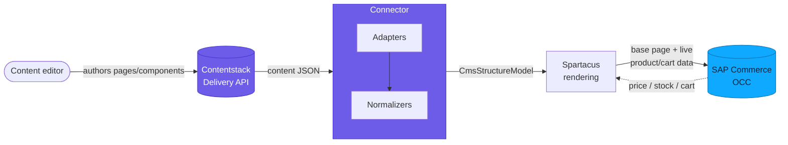

# SAP Spartacus Connector

`@contentstack/contentstack-spartacus-connector` — an open-source Angular feature library that makes **Contentstack** the CMS engine for an **SAP Composable Storefront (Spartacus)**, while **SAP Commerce (OCC)** stays the commerce engine. It overrides Spartacus's CMS adapter layer so page and component content resolve from Contentstack's Content Delivery API instead of OCC (`/occ/v2/{site}/cms/pages`), while product/cart/checkout data still hydrates live from SAP.

> [!INFO]
> These docs follow the [Contentstack product-wiki](https://github.com/contentstack/product-wiki) conventions so the docs team can review them and, if useful, promote them into the central wiki. Read [schema](schema.md) before editing. The repository's root Markdown files (`README.md`, `GETTING_STARTED.md`, `CONTENT-MODEL.md`, `TROUBLESHOOTING.md`) remain the source of truth; these pages organize and expand on them.

---

## How the pieces fit

Two data planes run side by side. A **content editor** authors pages and components in Contentstack; at request time the **connector** — its adapters and normalizers — fetches that content from the Delivery API and hands Spartacus a native `CmsStructureModel` to render. In parallel, Spartacus keeps talking to **SAP Commerce (OCC)** for the base page structure and for all live commerce data (product price, stock, cart). The result is one page whose *content* comes from Contentstack while its *commerce* stays SAP.

*Content flows Editor → Contentstack → connector → Spartacus; commerce data stays on the Spartacus → SAP OCC path.*

The default mode is **hybrid** (`occFallback: true`): OCC serves the base page and every commerce concern, and Contentstack overrides only the slots you actually author — the "editable islands." See [Concepts](concepts.md) for the full mental model and [Architecture](architecture.md) for the adapter-override chain that implements it.

---

## Pages in This Section

| File | Description |
|---|---|
| [Overview](overview.md) | What the connector is and isn't, the hybrid rendering model, supported features (flat navigation, editorial components, multi-language, Live Preview, access gating), known limitations, and current status |
| [Concepts](concepts.md) | The mental model — hybrid rendering with `occFallback`, slots as the unit of control, editable islands, and the two-token (`deliveryToken` + `previewToken`) security model |
| [Architecture](architecture.md) | The CMS adapter-override chain (`ContentstackCmsPageAdapter` / `ContentstackCmsComponentAdapter`), the normalizer pipeline into `CmsStructureModel`, DI "last-provider-wins" ordering, and the `ContentstackCmsFeatureModule` → `ContentstackModule` lazy-load composition |
| [Installation](installation.md) | End-to-end install and wiring walkthrough — content model import, feature-module wiring after the base Spartacus modules, the four connection values, and how to verify content is served from Contentstack |
| [Configuration](configuration.md) | The complete `ContentstackConfig` reference — `delivery` credentials, behavior options (`cmsPageContentType`, `slugField`, `localeMapping`, `occFallback`, `pageTypeMapping`, `globalSlots`, …), and `accessControl` |
| [Content Model](content-model.md) | The `cms_page` schema, page and component content types, the slot map (Contentstack field uid → SAP slot name), flat navigation (`*_flat` adjacency list), custom slots, and starter-pack seed guidance |
| [Live Preview](live-preview.md) | Live Preview / Visual Builder bindings and the `CsEditableDirective` / `CsEmptyBlockParentDirective` directives — non-production entry tagging and live updates |
| [Access Control](access-control.md) | Presentation-level, opt-in content gating via per-entry `access_tags` (`_require-login`, `_require-anonymous`, `_require-<roleGroupId>`) — a client-side hint, not a server-side security boundary |
| [API Reference](api-reference.md) | The public API surface — feature module, services, adapters, normalizers, directives, and configuration tokens |
| [Troubleshooting](troubleshooting.md) | Common integration issues (slots not rendering, DI ordering, locale fallback, reference-depth) and their fixes |

---

## Quick Start

1. Read [overview](overview.md) and [concepts](concepts.md) to understand the hybrid model — what Contentstack controls versus what stays on SAP OCC.
2. Follow [installation](installation.md) to import the content model and wire `ContentstackCmsFeatureModule` into a real Spartacus app (import it *after* the base Spartacus modules so the adapter overrides win).
3. Reference [configuration](configuration.md) and [content-model](content-model.md) while authoring — the `ContentstackConfig` block is fully typed, so your editor autocompletes every option.
4. When something doesn't render, jump to [troubleshooting](troubleshooting.md).

---

## Status

`0.1.0` — framework core validated end-to-end against a real Spartacus app + SAP OCC + Contentstack, plus Live Preview / Visual Editor bindings and the `ng add` schematic installer. The content model starter pack, a reference storefront, and B2B support are tracked as separate deliverables. See [Status](overview.md#status).
