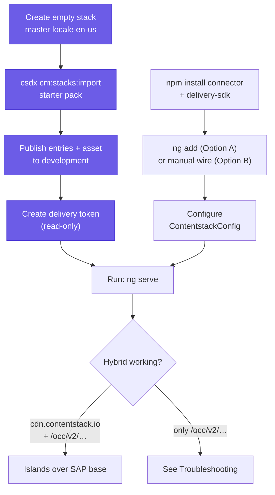
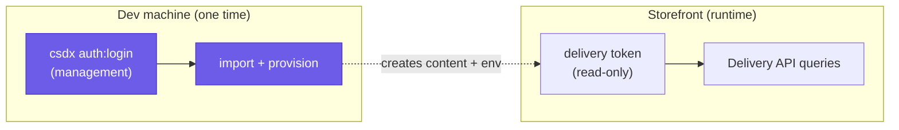

# Installation

Wire the connector into a **real, normally-scaffolded** Spartacus app (created via `ng add @spartacus/schematics`). This mirrors the repository's [`GETTING_STARTED.md`](../GETTING_STARTED.md); read [concepts](concepts.md) first for the hybrid model.

The connector runs in **hybrid** mode by default: **SAP Commerce (OCC) is the base for every page**, and Contentstack **overrides only the slots you author**. The shell (header, nav, footer) and functional pages (login, cart, checkout, order, track) keep rendering from SAP, so the storefront works end-to-end from the moment you start — and you manage just the marketing content headlessly. Commerce (products, cart, checkout, users) stays in SAP and hydrates live. See [`occFallback`](#step-4-configure) below and [Concepts › Hybrid rendering](concepts.md).

---

## Prerequisites

| Requirement | Notes |
|---|---|
| A working Spartacus app | Composable Storefront `2211.x`+ (Angular 21+). |
| A Contentstack stack | A read-only **delivery token** + **API key** for the storefront, and a **preview token** if you use Live Preview. Provisioning the content model uses `csdx auth:login` — no management token in the app. |
| A reachable SAP OCC backend | Your storefront already has one; the connector doesn't change how Spartacus talks to SAP for commerce. |
| Node + npm | Same toolchain your Spartacus app already builds with (the connector installs as a normal npm dependency + peer deps). |
| `@contentstack/cli` (`csdx`) | Installed globally for the one-time content-model import (Step 2). Dev machine only. |

> [!NOTE]
> Public npm's `@spartacus/*` packages cap out around `4.3.8` (Angular 12). The current Angular-21-era Composable Storefront is distributed **only** via SAP's private RBSC registry (requires an SAP Universal ID). See [troubleshooting](troubleshooting.md).

### The end-to-end install path

The five steps below split cleanly into two lanes that meet at the end: a **content lane** (create the stack, import the model, publish, mint a delivery token) and a **code lane** (install the package, wire the module, configure). Neither renders anything on its own — you need the delivery token from the content lane plugged into the config from the code lane before hybrid works.


*Content lane (purple) provisions the stack; code lane installs and wires; the delivery token is the hand-off between them.*

---

## Step 1: Install

```bash
npm install @contentstack/contentstack-spartacus-connector @contentstack/delivery-sdk
```

`@contentstack/delivery-sdk` is the runtime client the connector uses to query the Delivery API (it also exports the `Region` enum you reference in config). If you use [`ng add`](#option-a-recommended-ng-add) in Step 3, its schematic also runs a `NodePackageInstallTask` and adds the connector's peer dependencies to your `package.json` for you.

---

## Step 2: Provision the content model, demo seed (csdx)

Create an **empty stack** whose master locale is **English – United States (`en-us`)**, then import the **Content Model Starter Pack** (`import-export/starter-pack/`):

```bash
npm install -g @contentstack/cli
csdx config:set:region <NA | EU | AZURE-NA | ...>
csdx auth:login                                  # provisioning — dev machine only
csdx cm:stacks:import --stack-api-key <STACK_API_KEY> \
  --data-dir ./node_modules/@contentstack/contentstack-spartacus-connector/import-export/starter-pack \
  --yes
```

One command imports the **17 content types** (4 per-template page types + a `global_slots` shell + 12 component types), the **4 locales** (`en-us` master + `de-de`, `ja-jp`, `zh-cn`, all with `fallback_locale: en-us`), the **54 seed entry records** (`en-us` + `de-de`, references resolved), the **1 placeholder hero-banner asset**, and creates a **`development`** environment. No manual environment setup is needed — the pack ships `development` for you. See [`import-export/starter-pack/README.md`](../import-export/starter-pack/README.md) for the full manifest.

**Expected output (abridged):** csdx logs each module as it imports and finishes with the environment:

```
Starting import of content types ...
Migrating content type: landing_page ... done
... (17 content types)
Starting import of locales ...  4 locales imported
Starting import of assets ...   1 asset imported
Starting import of entries ...  54 entries imported
Starting import of environments ... development
The import process has completed successfully.
```

Then, in the Contentstack UI, **publish** the seed entries **and the asset** to `development` and create a **delivery token** for that environment (Settings → Tokens → Delivery Tokens, scoped to `development`). That token plus the stack API key are the only Contentstack credentials the storefront needs.

**Common pitfalls**

- **Wrong master locale.** The pack's entries are authored in `en-us`; a stack whose master locale is anything else will mis-resolve fallbacks. Create the stack with `en-us` as master before importing.
- **Region mismatch.** `csdx config:set:region` must match the stack's data center, and the same region has to be set on `delivery.region` in Step 4 — otherwise the storefront queries the wrong host and gets empty content.
- **Nothing renders after import.** The import stages content as *draft*. Until you **publish** the entries and asset to `development`, the delivery token returns nothing. Publishing is a manual UI step by design.
- **Partial data-dir.** Point `--data-dir` at the full starter-pack folder, not a subfolder — csdx expects a complete export skeleton (every module folder + a `global_fields` file) and crashes on an incomplete one.

> [!INFO]
> **Two-token model:** the storefront only ever uses a read-only **delivery token**. The privileged credential (`csdx auth:login`, or a scoped/expiring management token) is for the one-time import on your machine — never commit it, never ship it. See [The two-token security model](concepts.md#the-two-token-security-model).


*Two tokens, two lifetimes: the management credential provisions once on your machine; only the read-only delivery token ships in the app.*

---

## Step 3: Wire the module

### Option A (recommended): `ng add`

```bash
ng add @contentstack/contentstack-spartacus-connector
```

One interactive command generates an app-side `ContentstackFeatureModule` (with your `provideConfig(<ContentstackConfig>{…})`) and adds it to your `SpartacusFeaturesModule`. It prompts for region (a pick-list), Live Preview (y/n), fallback options, and credentials (blank answers scaffold `<PLACEHOLDER>`s to fill later). This wires **code/config** only — content still comes from the csdx starter-pack import in Step 2.

**What it writes** (paths relative to your project `sourceRoot`, usually `src/`):

| File | Purpose |
|---|---|
| `app/spartacus/features/contentstack/contentstack-feature.module.ts` | The generated `ContentstackFeatureModule` — imports `ContentstackCmsFeatureModule` and provides your `ContentstackConfig`. |
| `environments/contentstack.environment.ts` | Delivery credentials, exported as `contentstackDelivery` and imported by the feature module. |
| `app/spartacus/spartacus-features.module.ts` | Modified in place — `ContentstackFeatureModule` is added to its `imports`. |

The generated feature module scaffolds `localeMapping: { en: 'en-us', de: 'de-de' }` and `accessControl: { enabled: false }` on purpose (even at their defaults) so they're easy to find and turn on — a missing `localeMapping` is the usual cause of blank pages.

Pass answers as **kebab-case** flags for non-interactive/CI installs (the Angular CLI dasherizes multi-word schema options):

```bash
ng add @contentstack/contentstack-spartacus-connector \
  --api-key=… --delivery-token=… --environment=development \
  --region=US --cms-page-content-type=landing_page \
  --occ-fallback=true --include-fallback=false \
  --live-preview=false --interactive=false
```

The full flag set (from [`schematics/add-contentstack/schema.json`](../schematics/add-contentstack/schema.json)):

| Flag | Type / values | Default |
|---|---|---|
| `--api-key` | string (`blt…`) | scaffolds `<STACK_API_KEY>` |
| `--delivery-token` | string (`cs…`) | scaffolds `<DELIVERY_TOKEN>` |
| `--environment` | string | scaffolds `<ENVIRONMENT>` |
| `--region` | `US` \| `EU` \| `AZURE-NA` \| `AZURE-EU` \| `GCP-NA` \| `GCP-EU` | `US` |
| `--cms-page-content-type` | string | `landing_page` |
| `--occ-fallback` | boolean | `true` |
| `--include-fallback` | boolean | `false` |
| `--live-preview` | boolean | `false` |
| `--preview-token` | string (`cs…`) | scaffolds `<PREVIEW_TOKEN>` (emitted only when `--live-preview=true`) |
| `--project` | string | first project in `angular.json` |
| `--debug` | boolean | `false` |

The `--region` key is mapped to the `Region` enum member from `@contentstack/delivery-sdk` (`AZURE-NA` → `Region.AZURE_NA`, and so on) when the env file is generated.

Delivery credentials are written to **`src/environments/contentstack.environment.ts`** (referenced from the generated module), not inlined in the NgModule — so they stay out of the committed module and can be swapped per environment via Angular's `fileReplacements`. Fill any `<PLACEHOLDER>`s there.

**The `fileReplacements` pattern.** Keep the generated `contentstack.environment.ts` as your development credentials and mirror it per build target. In `angular.json`, the production configuration swaps in a production copy at build time:

```jsonc
// angular.json → projects.<app>.architect.build.configurations.production
"fileReplacements": [
  {
    "replace": "src/environments/contentstack.environment.ts",
    "with": "src/environments/contentstack.environment.prod.ts"
  }
]
```

The two files export the same `contentstackDelivery` shape with different `environment`/token values (and the prod copy omits `livePreview`/`previewToken`). Because the feature module imports the symbol, not a literal, no code changes — only the file the build resolves.

> [!WARNING]
> **Preview token is a secret.** A `previewToken` is emitted **only when you enable Live Preview**, and it grants read access to *unpublished* draft content. Use it only in a non-production build and do **not** commit a real value (git-ignore the env file if it holds one). The connector also refuses to activate Live Preview when the app runs in production mode, so a stray preview build can't leak drafts to end users.

### Option B: manual

If you'd rather wire it by hand, import the connector's feature module in `spartacus-features.module.ts` **after** the stock Spartacus feature/OCC modules. Angular DI is last-provider-wins, so import order is what lets the connector's CMS adapters sit in front of the OCC ones:

```ts
import { ContentstackCmsFeatureModule } from '@contentstack/contentstack-spartacus-connector';

@NgModule({
  imports: [
    // ...existing Spartacus feature/OCC modules stay as-is...
    ContentstackCmsFeatureModule, // <-- add last
  ],
})
export class SpartacusFeaturesModule {}
```

With the manual path you provide the config yourself (Step 4) rather than having `ng add` scaffold it. `ContentstackCmsFeatureModule` is the single entry point: it registers the connector's default config and **eagerly imports** the CMS override module (`ContentstackCmsModule`) and the Live Preview module (`ContentstackLivePreviewModule`). The import is deliberately eager — the CMS adapter has to be in the DI graph *before* the first page resolves at bootstrap — so the connector does **not** use the lazy `CmsConfig.featureModules` gate (that gate only fires when a feature-tagged `cmsComponents` entry renders, which this library never registers). Importing `ContentstackCmsFeatureModule` after the base modules is all the wiring you need.

> [!WARNING]
> **Ordering matters — and failures are silent.** If `ContentstackCmsFeatureModule` is imported *before* the stock Spartacus modules (or omitted), the OCC adapters win the DI race, pages keep rendering straight from SAP OCC, and **no error is thrown**. If content isn't coming from Contentstack, check this ordering first.

---

## Step 4: Configure

`ng add` generates this block for you inside the feature module; add it yourself if you took the manual path. In `spartacus-configuration.module.ts` (or the generated `contentstack-feature.module.ts`):

```ts
import { ContentstackConfig } from '@contentstack/contentstack-spartacus-connector';
import { provideConfig } from '@spartacus/core';

provideConfig(<ContentstackConfig>{
  contentstack: {
    delivery: {
      apiKey: '<STACK_API_KEY>',
      deliveryToken: '<DELIVERY_TOKEN>',   // read-only, safe in the client bundle
      environment: '<ENVIRONMENT>',        // e.g. development
      // Live Preview / Visual Builder (optional). NON-PRODUCTION builds only.
      livePreview: true,
      previewToken: '<PREVIEW_TOKEN>',
    },
    // Page content type resolved for content/landing routes (incl. the homepage).
    cmsPageContentType: 'landing_page',
    // Map site language isocodes -> Contentstack locale codes (only where they differ).
    localeMapping: { en: 'en-us', de: 'de-de', ja: 'ja-jp', zh: 'zh-cn' },
    // occFallback defaults to true (hybrid). Set false only for full-replacement mode.
  },
}),
```

Notes:
- **`occFallback`** is `true` by default — that's what makes the shell/commerce pages render from OCC. Leave it on.
- **Multi-language:** with locales that have a `fallback_locale`, unlocalized content inherits the master locale automatically. `includeFallback: true` adds the delivery-query fallback for edge cases.
- **`region`** — set on `delivery` to match your stack's data center (`Region.US` / `EU` / `AZURE_NA` / …), and it must match the region you provisioned the stack under in Step 2.
- **`cmsPageContentType`** is the single per-route page type queried by slug; the starter pack authors the home as `landing_page`. Shared-layout pages (product, category) map through `pageTypeMapping` instead.

The `ContentstackConfig` interface augments Spartacus's `Config`, so your editor autocompletes and type-checks the whole block with each field's JSDoc on hover. See [configuration](configuration.md) for the full option set.

---

## Step 5: (Only for custom components) map content types to Angular components

The editorial starter-pack types (banner, carousel, paragraph, link, …) map to **stock** Spartacus components automatically via their SAP typecodes — no config needed. You only add a `cmsComponents` mapping for your **own** components; follow [`src/examples/hero-banner/custom-hero.module.ts`](../src/examples/hero-banner/custom-hero.module.ts).

The `cmsComponents` map key **must equal** the SAP typecode the normalizer emits (see [Field naming and SAP mapping](content-model.md#field-naming-and-sap-mapping)).

---

## Step 6: Run and verify

```bash
ng serve   # or your SSR command
```

Expect:
1. The full **SAP shell** (header, nav, footer) + functional pages render from OCC — the store works end-to-end.
2. Slots you authored in Contentstack (e.g. the home hero/carousel) render as **islands** over that base. DevTools → Network shows **both** `cdn.contentstack.io` (content) **and** `/occ/v2/...` (base + commerce) — that's hybrid working.
3. Switching site language reloads the Contentstack content in the matching locale (or falls back to master where unlocalized).

**What "hybrid working" looks like in DevTools.** Open DevTools → Network, filter, and reload the home page:

- A request to **`cdn.contentstack.io`** (or your region's delivery host) returning the `landing_page` entry with its resolved slot references — this is Contentstack serving the authored islands.
- Requests to **`/occ/v2/<site>/...`** for the base page structure and for live commerce data (product price/stock, cart) — this is SAP serving the base and hydrating commerce.
- Seeing **only** `/occ/v2/...` and no `cdn.contentstack.io` call means the connector isn't intercepting — recheck module import ordering ([Option B](#option-b-manual)) and that `localeMapping` resolves to a locale your stack actually has. See [troubleshooting](troubleshooting.md).
- Switching the site language should fire a fresh Contentstack query in the mapped locale; the seed's `de-de` menus relabel (e.g. *Cameras → Kameras*) while `ja`/`zh` fall back to English.

---

## Verification (in-repo)

This library targets `@spartacus/*` public contracts; a full end-to-end run requires a live SAP OCC backend + a Contentstack stack. Offline gates:

| Command | What it proves |
|---|---|
| `npm run typecheck` | Adapters, normalizers, LP/VE services, and the schematic conform to the real Spartacus contract shapes. Resolves `@angular/*`/`rxjs`/`@ngrx/store` from `node_modules` and `@spartacus/*` from `typings/`. |
| `npm test` | Pure-logic Contentstack→Spartacus transforms (page + component normalizers, the three component-specific normalizers, and type guards) via lightweight stubs. |
| `npm run test:schematics` | The `ng add` schematic via the real `SchematicTestRunner` against a test-only `@spartacus/schematics` stub. Verifies `collection.json`/`schema.json` wiring. |
| `npm run test:all` | Both test suites. |

> [!NOTE]
> `typings/` shims exist only for the offline typecheck; they are unused once the real `@spartacus/*` / `@contentstack/delivery-sdk` packages are installed.

---

## Where to go next

- Content model + slot reference → [content-model](content-model.md)
- The starter pack (import) → [`import-export/starter-pack/README.md`](../import-export/starter-pack/README.md)
- Full config reference → [configuration](configuration.md)
- Not rendering / errors → [troubleshooting](troubleshooting.md)
