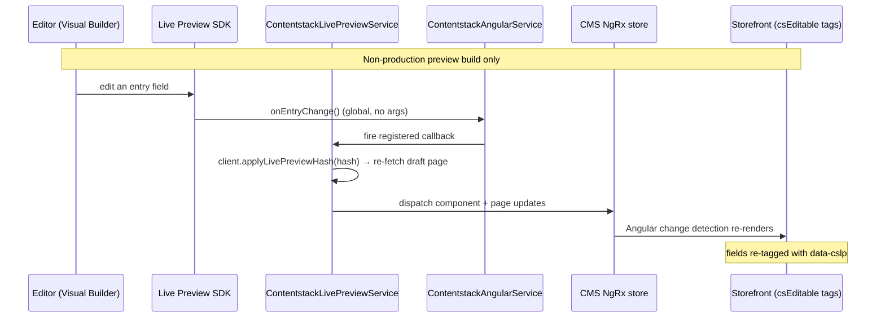

# Live Preview

Contentstack **Live Preview / Visual Builder** support: entry tagging plus live updates so editors see their changes in-context, in the running storefront, with no refresh or redeploy. Implemented in [`src/live-preview/`](../src/live-preview).

Live Preview solves the "author blind" problem of headless CMS: because content is delivered as JSON to a storefront the CMS doesn't own, an editor normally can't tell which on-page element maps to which entry field. This feature closes that gap two ways:

- **Entry tagging** — every Contentstack-sourced field on the page carries a `data-cslp` attribute that maps the DOM element back to its `content_type.entry.locale.field`, so Visual Builder can draw edit handles over exactly the right elements (component-to-entry navigation, plus per-field click-to-edit).
- **Live updates** — when an editor changes an entry in Visual Builder, the connector re-fetches the *draft* of the current page and pushes it into Spartacus's CMS store, so the change renders live in the storefront panel.

> [!WARNING]
> **Non-production only.** Live Preview is ignored in production builds, and the connector **refuses to activate** it when the app runs in Angular production mode — so a stray preview build can't leak drafts to end users. The `previewToken` grants read access to *unpublished* draft content: treat it as a **secret**, keep it out of committed source and prod. See [The two-token security model](concepts.md#the-two-token-security-model).

---

## Enabling it

Set `livePreview: true` (with a `previewToken`) on `contentstack.delivery`:

```ts
provideConfig(<ContentstackConfig>{
  contentstack: {
    delivery: {
      apiKey: '<STACK_API_KEY>',
      deliveryToken: '<DELIVERY_TOKEN>',
      environment: '<ENVIRONMENT>',
      livePreview: true,
      previewToken: '<PREVIEW_TOKEN>',   // secret — non-prod only
      // previewHost: optional; defaults to the US preview host
    },
  },
})
```

The three Live Preview options (declared on `contentstack.delivery` in [`src/config/contentstack-config.ts`](../src/config/contentstack-config.ts)):

| Option | Type | Default | Notes |
|---|---|---|---|
| `livePreview` | `boolean` | `false` | Master switch. When true, the delivery stack is built with Live Preview enabled and the Visual Builder SDK initializes in the storefront. Requires `previewToken`. Leave `false` for normal production builds. |
| `previewToken` | `string` | — | Preview token (separate from the delivery token). Required when `livePreview` is true — the delivery SDK uses it to fetch draft content from the preview host. **Secret.** |
| `previewHost` | `string` | `rest-preview.contentstack.com` (US) | Preview REST host. Set the region-matching host for EU / Azure / GCP stacks. |

With `ng add`, a `previewToken` is emitted **only when you enable Live Preview** during the prompts (the schematic asks region, Live Preview y/n, and fallback options). See [Step 3 — Wire the module](installation.md#step-3-wire-the-module) and [contentstack.delivery — connection & credentials](configuration.md#contentstackdelivery-connection-credentials).

### Why the preview token is a secret, and how production is guarded

`previewToken` reads **unpublished** draft content over the preview host. If that reached end users it would leak in-progress work. Two independent guards enforce non-production use, both in [`ContentstackClientService`](../src/client/contentstack-client.service.ts):

1. On stack build, the client computes `inProduction = !isDevMode()`. If `livePreview` is set while in production it **logs a warning and does not enable Live Preview** — the stack is built without the `live_preview` block.
2. The effective flag is `enableLivePreview = !!delivery.livePreview && !!delivery.previewToken && !inProduction`. Live Preview only routes through the preview host when *all three* hold: the flag is on, a preview token is present, and the build is non-production.

```ts
// contentstack-client.service.ts (paraphrased)
const inProduction = !isDevMode();
if (delivery.livePreview && inProduction) {
  this.logger.warn('… refusing to activate it so unpublished draft content is not exposed …');
}
const enableLivePreview = !!delivery.livePreview && !!delivery.previewToken && !inProduction;
```

Practically: run Live Preview from a dedicated non-production build (`ng serve` / a preview environment), keep `previewToken` in `.env*` or CI secrets, and never commit it.

---

## How it works

`ContentstackCmsFeatureModule` **eagerly** imports `ContentstackLivePreviewModule`. It was previously behind a lazy `CmsConfig.featureModules` entry (the standard Spartacus code-splitting convention), but that gate only fires when a `cmsComponents` component tagged with the feature renders — which this connector never registers — so the entry never loaded and the decorator never activated. Importing it eagerly fixes that, so the decorator is in place as component wrappers are created and the whole-entry `data-cslp` tag can be applied (see [Module composition and DI ordering](architecture.md#module-composition-and-di-ordering)). The module registers `ContentstackComponentDecorator` over Spartacus's `ComponentDecorator` extension point with `multi: true` (that provider is a Spartacus multi-provider; a plain single provider throws at render time).

The eager import adds no cost to normal delivery builds: `ContentstackLivePreviewService` checks `delivery.livePreview` in its constructor and **returns early / stays inert** when Live Preview is off, so the decorator finds no tags to add and does nothing.

When Live Preview *is* on, the flow from an editor keystroke to a re-rendered storefront is:


*An edit in Visual Builder fires the global SDK event; the connector re-fetches the draft page and pushes it into the CMS store so Angular re-renders — only in a non-production preview build.*

Key detail: Contentstack's `onEntryChange(callback)` is a **single global, argument-less** listener — it says *that* something changed, not *what*. So the default handler reloads the **whole current page**: it calls `applyLivePreviewHash(hash)` to point the delivery stack at the draft being edited, re-runs the page adapter for the current route, dispatches each component with `LoadCmsComponentSuccess`, then dispatches the page structure with `LoadCmsPageDataSuccess` so slot additions / removals / reordering also render live (component-data updates alone would leave the old slot layout in place).

In **hybrid mode** the re-run page adapter returns the merged structure (OCC base + Contentstack overrides), so live edits apply to the Contentstack "islands" while OCC-sourced slots stay put. To make an OCC section editable, author that slot in Contentstack so it becomes an island. See [Concepts — hybrid mode](concepts.md) and [The editable islands model](concepts.md).

### Language handling during a session

The Visual Builder SDK is initialized **once per bootstrap** and is single-locale for that session, but the storefront's on-page edit tags still follow the shopper's language:

- The service subscribes to `LanguageService.getActive()` and maps each Spartacus isocode to a Contentstack locale via `localeMapping` (identity fallback; `en-us` when nothing is resolved yet), mirroring the delivery client's `resolveLocale`.
- On the **first** language, it initializes the SDK (`mode: 'builder'`, `ssr: false`) and registers the `onEntryChange` re-fetch.
- On a **later** language switch it doesn't re-init; instead `retagEditTagsForLocale` rewrites the locale segment of every `data-cslp` tag already in the DOM. Because a CSLP v1 tag is `contentTypeUid.entryUid.locale[.field…]` and an entry's uid is the same across locales, retargeting is a pure locale-segment swap (`retargetTagLocale` in [`tag-entry-tree.ts`](../src/live-preview/tag-entry-tree.ts)) — no re-fetch or re-render.

### The symbol table

`ContentstackLivePreviewModule` and the services it depends on wire the following:

| Symbol | Role |
|---|---|
| `ContentstackLivePreviewService` | Orchestrator. Inits the Live Preview SDK once (subscribed to the active language), registers the global `onEntryChange` re-fetch, and on each edit re-fetches the draft page and dispatches updates into the CMS store. Inert when `livePreview` is off. |
| `ContentstackAngularService` | Thin wrapper over Contentstack's real SDK (`@contentstack/live-preview-utils`). Exposes `init(...)`, `onEntryChange(cb)`, the current `hash`, and `addEditableTags` (from `@contentstack/utils`). Keeps the runtime in step with Angular change detection. |
| `ContentstackComponentDecorator` | Extends Spartacus `ComponentDecorator`. On each rendered component wrapper, applies a coarse whole-entry `data-cslp` tag (`content_type.entry.locale`) for component-to-entry navigation — unless the element is already tagged. |
| `CsEditableDirective` (`csEditable`) | Standalone directive for per-field edit tags — binds a field's `data-cslp` so Visual Builder shows click-to-edit for that field. |
| `CsEmptyBlockParentDirective` (`csEmptyBlockParent`) | Standalone directive that marks an empty slot/block with `visual-builder__empty-block-parent` so Visual Builder renders an "add content" drop target where nothing is authored yet. |
| `tagEntryTree` / `retargetTagLocale` | Pure helpers ([`tag-entry-tree.ts`](../src/live-preview/tag-entry-tree.ts)). `tagEntryTree` tags a fetched entry and every nested referenced entry with **its own** content type so the deepest tag wins; `retargetTagLocale` swaps a tag's locale segment for the language-switch retag. |

> [!NOTE]
> `@contentstack/utils` (which provides `addEditableTags`) and `@contentstack/live-preview-utils` (the Visual Builder SDK, `onEntryChange`/`hash`/`VB_EmptyBlockParentClass`) are two separate real packages. `ContentstackAngularService` derives the SDK's internal init/callback types structurally from the installed signatures rather than importing unexported type names.

---

## Wiring the directives into your templates

The two directives are `standalone: true`, so import them directly into whichever slot/component template needs them — they need no module declaration.

**Per-field editing** — bind `csEditable` to the tag object produced for that field (`entry.$[fieldUid]`, e.g. `entry.$?.title`). The directive accepts either the `{ 'data-cslp': string }` object (what this connector produces via `tagsAsObject` mode) or a plain string, and sets/removes `data-cslp` accordingly:

```html
<!-- top-level field -->
<h1 [csEditable]="entry.$?.title">{{ entry.title }}</h1>

<!-- nested modular-block field -->
<div [csEditable]="entry.$?.blocks__0">…</div>
```

Angular templates can't spread JSX-style props (`{...entry.$.title}`), so this directive is the reusable equivalent of hand-binding `[attr.data-cslp]="entry.$?.title?.['data-cslp']"` on every field.

**Empty-slot affordance** — mark a slot container so Visual Builder shows its add-a-block placeholder when the slot has no components. Bind the slot's components array (marked when the array is empty) or a boolean — the directive's setter treats an empty array (or a truthy boolean) as "empty" and adds the class:

```html
<div [csEmptyBlockParent]="slot.components">…components…</div>
```

The connector can't apply this one itself — an empty slot has no component to decorate, and slot containers live in the *consuming* storefront's templates — so the storefront attaches the directive to each slot wrapper. It adds/removes the exact class Visual Builder looks for, `VB_EmptyBlockParentClass` (`visual-builder__empty-block-parent`), re-exported from the SDK so the constant stays in lockstep.

**Where tags come from.** You rarely tag entries by hand: when `delivery.livePreview` is on, `ContentstackClientService` calls `tagForLivePreview` on each fetched page (via `tagEntryTree`), populating `entry.$` with the per-field tag objects that `csEditable` consumes, and the component decorator adds the coarse whole-entry tag on each wrapper. Your job is just to bind `csEditable` to the fields you want individually editable and `csEmptyBlockParent` on empty slots. For the exact selectors and inputs, see the source in [`src/live-preview/`](../src/live-preview) and the exports in [Live Preview / Visual Editor](api-reference.md#live-preview--visual-editor).

---

## Related

- [configuration](configuration.md) — `livePreview`, `previewToken`, `previewHost`
- [Live Preview / Visual Editor](api-reference.md#live-preview--visual-editor) — exported services, decorator, and directives
- [The two-token security model](concepts.md#the-two-token-security-model) — why the preview token is a secret
- [Module composition and DI ordering](architecture.md#module-composition-and-di-ordering) — why the Live Preview module is eager
- [Concepts](concepts.md) — hybrid mode and the editable-islands model
