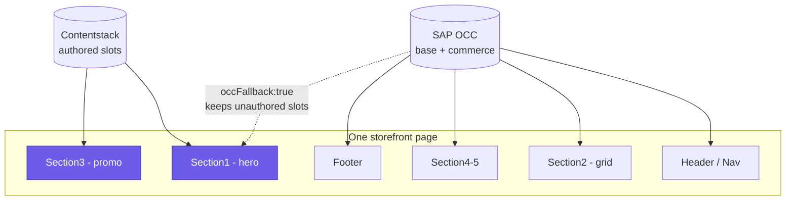

# Overview

`@contentstack/contentstack-spartacus-connector` is an open-source Angular feature library that makes **Contentstack** the CMS engine for an **SAP Composable Storefront (Spartacus)**, while **SAP Commerce (OCC)** remains the commerce engine.

It overrides Spartacus's CMS adapter layer so page and component content resolve from Contentstack's **Content Delivery API** instead of `/occ/v2/{site}/cms/pages`. Product data still hydrates live from SAP at render time.

The result is a storefront that keeps working exactly as it does today — the full SAP shell, navigation, footer, and every functional page (login, cart, checkout, order, track) still render from OCC — while the marketing content you choose to author moves into a headless CMS. You get to manage that content in Contentstack without giving up the commerce engine, the catalog, or the customer session that SAP already provides.

---

## What it does

At its core the connector is a small stack of Spartacus adapter overrides plus payload normalizers. Spartacus asks its CMS layer for a page by URL; the connector answers that question from Contentstack instead of OCC, translates the Contentstack payload into the exact `CmsStructureModel` shape Spartacus expects, and then steps out of the way so Spartacus's own rendering engine draws the page. Commerce data (price, stock, add-to-cart) is never in that payload — components read a SAP SKU out of the Contentstack entry and pull the live commerce facts from SAP as they render.

| Concern | How |
|---|---|
| **Intercept CMS routing** | `ContentstackCmsPageAdapter` / `ContentstackCmsComponentAdapter` replace the OCC adapters and query Contentstack by URL slug. |
| **Translate the payload** | `ContentstackCmsPageNormalizer` maps the page schema (named per-slot reference fields → resolved component entries) into Spartacus's native `CmsStructureModel` (page → slots → components), mapping slot field uids to SAP slot names and content-type uids to SAP typecodes. |
| **Map content types to components** | `CmsConfig.cmsComponents` maps each SAP typecode (e.g. `SimpleResponsiveBannerComponent`) to an Angular component. |
| **Resolve component-specific fields** | `ContentstackCmsComponentNormalizer` composes three content-type-specific normalizers by typecode: banner media, navigation (flat adjacency-list rebuilt into a tree), and product carousel (OCC product URLs → `productCodes`). |
| **Hydrate SAP data** | Components read the SAP SKU from Contentstack and pull live price/stock/add-to-cart via Spartacus `ProductService` / `ActiveCartFacade`. |
| **Bypass SAP SmartEdit** | Never imports `SmartEditRootModule`; `smartEditBypassGuard` neutralizes inbound preview params. |
| **Bundle the integration** | `ContentstackCmsFeatureModule` (the module you import) registers config and eagerly imports the CMS adapter override + Live Preview modules. |

The reason each override matters becomes clearer once you picture a single page. In the default **hybrid** mode, OCC still returns the base page structure for every route — the header, navigation, most sections, and the footer. Contentstack only *overrides* the specific slots you have authored. Those authored slots are the "editable islands"; everything around them stays on OCC because `occFallback` is `true` by default.

*Hybrid islands: OCC renders the whole page; Contentstack overrides only the authored slots (Section1 hero, Section3 promo), and `occFallback:true` leaves every unauthored slot on OCC.*

See [architecture](architecture.md) for how these fit together and [concepts](concepts.md) for the mental model behind them.

---

## Supported features

The features below are what a normally-scaffolded Spartacus app gets after wiring in the connector and importing the content-model starter pack. Read each row as "what you can do" plus the mechanism that makes it work.

| Capability | Notes |
|---|---|
| **Hybrid rendering** | OCC serves the base page + all commerce data; Contentstack overrides authored slots. `occFallback: true` (default) keeps unauthored slots/pages on OCC. |
| **Flat navigation** | Header + footer menus of any depth via the `*_flat` adjacency-list model — resolves in a constant, shallow include chain, so the Delivery API's plan-gated reference-depth cap never applies. |
| **Editorial components** | Banner, responsive banner, product carousel, paragraph, tab paragraph, link, flex → stock Spartacus components by SAP typecode; no `cmsComponents` config needed. |
| **Multi-language** | `localeMapping` (site isocode → Contentstack locale) plus master-locale fallback; `includeFallback` adds query-time fallback. |
| **Live Preview / Visual Builder** | Entry tagging + live updates via `CsEditableDirective` / `CsEmptyBlockParentDirective` (non-production). See [live-preview](live-preview.md). |
| **Access gating** | Opt-in per-entry `access_tags` (`_require-login`, `_require-anonymous`, `_require-<roleGroupId>`). See [access-control](access-control.md). |

A few of these deserve a closer look:

- **Hybrid rendering** is the default, and it is what keeps the migration low-risk. Because OCC is the base for every page, an app that imports the connector but authors *nothing* in Contentstack renders identically to before. You then move content over one slot at a time. In DevTools → Network you will see calls to **both** `cdn.contentstack.io` (the authored content) and `/occ/v2/...` (the base page plus commerce) on the same page — that dual traffic is the signature of hybrid mode working.

- **Flat navigation** exists because a header or footer menu can be arbitrarily deep, and resolving a deep tree through nested reference fields would run into the Delivery API's plan-gated reference-depth cap. The `*_flat` model sidesteps this by storing every node in one `all_nodes` pool with a text `parent_id`; the navigation normalizer rebuilds the `CmsNavigationNode` tree from that adjacency list on the client, so the include chain stays constant and shallow no matter how deep the menu is.

- **Editorial components** map to *stock* Spartacus components automatically. The starter-pack types — banner, responsive banner, product carousel, paragraph, tab paragraph, link, flex — each normalize to a SAP typecode that Spartacus already knows how to render, so you do **not** write any `cmsComponents` mapping for them. You only add a `cmsComponents` entry when you introduce your **own** component (see the `src/examples/hero-banner` pattern).

- **Multi-language** works off `localeMapping`, which maps a Spartacus site isocode (e.g. `en`) to a Contentstack locale (e.g. `en-us`); you only need to list the ones that differ. Where an entry is not localized, the master locale is used, and `includeFallback: true` additionally requests the delivery-query fallback for edge cases.

- **Access gating** is opt-in and off by default. When enabled it reads per-entry `access_tags` (`_require-login`, `_require-anonymous`, or `_require-<roleGroupId>`) and shows or hides content based on the shopper's SAP login state and role groups. It is a presentation-level convenience, not a security boundary — see [What it is not](#what-it-is-not).

---

## Known limitations

These are deliberate boundaries of the current design, not bugs. Knowing them up front tells you how to model content so it renders where you expect.

| Limitation | Detail |
|---|---|
| **Page-type resolution** | Per-route pages resolve against a single `cmsPageContentType`. **Shared-layout** types (product, category) get their own content type via `pageTypeMapping`. Serving multiple *distinct per-route* content types isn't supported yet; unmapped page types fall back to OCC. |
| **Reference fields, not Modular Blocks** | Slots are multi-reference fields resolved via `includeReference`. Contentstack **Modular Blocks** are **not** read — model components as separate content types referenced from the page/shell. |
| **Author into slots the template renders** | A component shows only if the SAP page template renders its slot. |
| **Access gating is presentation-level** | Hides content in the client based on SAP login state / role groups — **not** a server-side security boundary. Off by default. |
| **Shared-slug product/category pages** | One shared entry serves every PDP / PLP; product and facet data always come from OCC. |
| **Live Preview is non-production** | Ignored in production builds; the `previewToken` grants draft read access — treat it as a secret. |
| **Content i18n only** | Content localizes via Contentstack locales; Spartacus's own UI-label i18n is unchanged. |

What these mean in practice:

- **Page-type resolution.** Content and landing routes (including the homepage) resolve against the single `cmsPageContentType` — the starter pack authors the home as a `landing_page`. Shared-layout page types such as product and category are handled separately through `pageTypeMapping`, which pairs a `contentTypeUid` with a `sharedSlug`; the pack ships `product_page` and `category_page` for exactly this. What is *not* yet supported is serving many *distinct per-route* content types; any page type you have not mapped simply falls back to OCC.

- **Reference fields, not Modular Blocks.** Slots are multi-reference fields, and the connector expands the referenced component entries via `includeReference`. Contentstack **Modular Blocks** (inline composed blocks) are **not** read. Model each component as its own content type referenced from the page or shell, rather than as a modular block inside one entry.

- **Author into slots the template renders.** A Contentstack component only appears if the SAP page template actually renders that slot. For example `LandingPage2Template` renders `Section1`, `Section2A/2B/2C`, and `Section3`–`Section5` — there is **no bare `Section2`** (that name belongs to `CategoryPageTemplate`), and `Section2A/2B/2C` are narrow one-third-width columns. Full-width content therefore belongs in `Section1` or `Section3`–`Section5`. Authoring into a slot the template never renders produces no visible output.

- **Shared-slug product/category pages.** One shared entry serves every PDP and every PLP; product and facet data always come from OCC. You cannot yet author a unique Contentstack entry per individual product or category through this path.

- **Live Preview is non-production.** Live Preview / Visual Builder is ignored in production builds, and the connector refuses to activate it when the app runs in production mode. The `previewToken` grants read access to unpublished drafts, so treat it as a secret and keep it out of committed source and out of prod.

---

## What it is not

- **Not a commerce replacement.** Products, cart, checkout, users, and pricing stay in SAP Commerce and hydrate live. The connector only takes over the CMS/content layer. A component may store a SAP SKU in Contentstack, but the price, stock, and add-to-cart behavior for that SKU still come from OCC through Spartacus's own `ProductService` / `ActiveCartFacade`.

- **Not a full-storefront CMS by default.** In the default hybrid mode you only author the slots you want; everything else — the shell, navigation, footer, and functional pages like login, cart, checkout, order, and track — renders from OCC exactly as it does today. Full-replacement mode (`occFallback: false`) exists, but hybrid is the intended and validated default.

- **Not a security boundary.** [Access gating](access-control.md) tailors what the UI shows based on login state and role groups; it does not protect confidential data. The delivery token ships in the client bundle and is read-only by design, so any content delivered to the browser is reachable regardless of the gating tags. Gate for presentation, not for secrecy.

---

## Status

`0.1.0`.

- **Validated end-to-end** (real Spartacus app + SAP OCC + Contentstack): framework core, Live Preview / Visual Editor bindings, and the `ng add` schematic installer.
- **Ships in the repo:** the content-model starter pack (`import-export/starter-pack/`), imported via `csdx` — see [installation](installation.md#step-2-provision-the-content-model-demo-seed-csdx).
- **Tracked separately:** a reference storefront and B2B support.

Put another way, the parts that override Spartacus's CMS layer — the adapters, the page and component normalizers, the Live Preview / Visual Editor services, and the `ng add` schematic that wires it all in — have each been exercised against a live Spartacus app talking to a real SAP OCC backend and a real Contentstack stack. The content model you import — the starter pack — ships with the repo under `import-export/starter-pack/`; a reference storefront and B2B support are tracked separately from the library itself.

> [!NOTE]
> This library targets `@spartacus/*` public contracts. A full end-to-end run requires a live SAP OCC backend + a Contentstack stack. In-repo verification is available via `npm run typecheck`, `npm test`, and `npm run test:schematics` — see [Verification](installation.md#verification-in-repo).

Because a full run needs live backends, day-to-day changes are gated offline: `npm run typecheck` checks the adapters, normalizers, LP/VE services, and schematic against transcribed `@spartacus/*` contract shapes; `npm test` runs the pure Contentstack→Spartacus transform specs; and `npm run test:schematics` drives the `ng add` schematic through the real `SchematicTestRunner`. These prove the code conforms to the contracts without needing SAP or Contentstack running.

---

## Related

- [concepts](concepts.md) — the hybrid model, slots, islands, and the two-token security model
- [architecture](architecture.md) — how the override chain and normalizers work
- [installation](installation.md) — get it running
- Repository docs: `README.md`, `GETTING_STARTED.md`, `CONTENT-MODEL.md`, `TROUBLESHOOTING.md`
