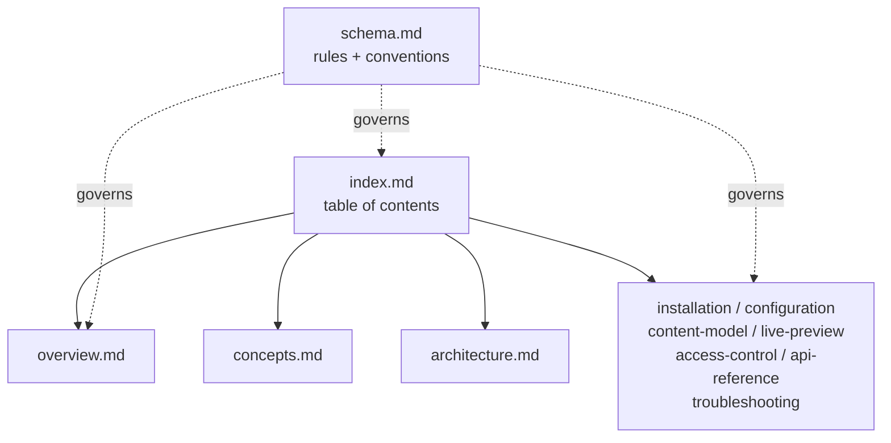
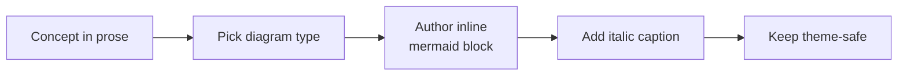

# Documentation Conventions

This is a contributor guide for the connector's documentation. **Read it before making any edits to `docs/`.** It does not describe the connector; it describes how the pages that describe the connector are named, structured, linked, and illustrated. Treat it the way you would treat a style guide or a linter config: the rules here keep every page consistent and keep anchors stable so cross-links do not rot.

The docs are plain Markdown with YAML frontmatter, relative-link navigation, and GitHub-flavored callouts, so they render correctly in the GitHub file browser, a local clone, and on the published docs site without any special tooling.

The doc set is deliberately a **flat spine** of single-topic pages rather than a deep tree. The two anchor pages, `index.md` and `schema.md`, point at everything else; every content page is a leaf off that spine.


*The doc spine: `index.md` links readers to every content page, while `schema.md` sets the rules those pages follow.*

---

## Required Top-Level Files

| File | Type | Purpose |
|---|---|---|
| `index.md` | `index` | Table of contents — always updated when files are added/removed |
| `schema.md` | `schema` | This file — org rules, naming conventions, structure |
| `overview.md` | `overview` | What the connector is, what it does, current status |

These three files are the only ones guaranteed to exist at every stage of the doc set's life. `index.md` is the reader's entry point and must always list the current page set — a page that exists on disk but is missing from `index.md` is effectively unfindable. `schema.md` is the editor's entry point. `overview.md` is the newcomer's entry point. Keep all three in sync: adding or removing any content page means updating the table in `index.md` and, where relevant, the [Category Map](#category-map-what-each-page-holds) below.

---

## Naming Conventions

- Filenames: **lowercase, hyphen-separated** (e.g. `content-model.md`, `api-reference.md`).
- No spaces, no underscores, no camelCase in filenames.
- Descriptive names that reflect content, not document type.

The reason for the hyphen-and-lowercase rule is portability: these filenames become URL slugs and anchor targets on GitHub and on the published docs site, and both are case- and separator-sensitive. A file named `Content_Model.md` and one named `content-model.md` produce different links, so a single convention avoids broken cross-references when a page moves between environments. "Descriptive, not document type" means prefer `live-preview.md` over `guide.md` or `page3.md` — the name should tell a reader what the page holds before they open it.

---

## Frontmatter Requirements

Every file must include valid YAML frontmatter:

```yaml
---
title: "<Human-readable title>"
product: spartacus-connector
type: "<overview | architecture | concepts | api | reference | status | schema | index | troubleshooting>"
tags: [spartacus-connector, <topic-tags>]
last_updated: "<YYYY-MM-DD>"
---
```

Update `last_updated` whenever a file is modified.

The frontmatter lets a docs site (or any indexer) title, categorize, and group these pages automatically, so it is not optional decoration. Keep `product: spartacus-connector` identical on every page — it is the key that collects the set into one product group. Pick the `type` from the enumerated list rather than inventing a new value. `tags` should always lead with `spartacus-connector` and then add a few topic tags that describe the page's subject (for example `[spartacus-connector, live-preview, visual-builder]`). The `last_updated` date is a freshness signal — a page whose body changed but whose date did not looks stale even when it is current, so treat bumping the date as part of the edit, not an afterthought.

---

## Internal Links

Use standard relative Markdown links for internal navigation so they render everywhere (GitHub, VS Code, and other Markdown viewers):

- `[Overview](overview.md)` — link to a file in this directory.
- `[Status](overview.md#status)` — link to a section.

Link out to the repository's source-of-truth Markdown (`README.md`, `GETTING_STARTED.md`, `CONTENT-MODEL.md`, `TROUBLESHOOTING.md`) and to `src/` files with relative Markdown links.

Relative links are the only form that survives every place these pages are read — the GitHub file browser, a local clone opened in an editor, and the published docs site all resolve `overview.md` and `../README.md` correctly, whereas absolute or site-rooted URLs break the moment the docs move. Section links use the GitHub-style slug of the heading text (lowercased, spaces to hyphens, punctuation dropped), which is exactly why the [heading-preservation rule](#category-map-what-each-page-holds) matters: renaming a heading silently breaks every `#anchor` link pointing at it. When you cite the shipped source rather than another doc page, link to the actual file with a `../` path so a reader can jump straight to the ground truth.

> [!NOTE]
> Do **not** author Obsidian-style `[[wikilinks]]` — they don't render on GitHub or on the published docs site, so they would break navigation in the environments these docs actually live in. Use relative Markdown links, as shown above.

---

## Diagrams

Diagrams in this doc set are authored as **inline fenced ```mermaid blocks placed directly in the page**, at the section they illustrate. This is the single, consistent convention across every page — there are no separate image or SVG files, and there is no `_attachments` (or similar) folder for diagram assets.

Rules for every diagram:

- **Inline, not external.** Write the diagram as a fenced ` ```mermaid ` code block in the Markdown itself. Do not export it to `.png`/`.svg` and embed an image, and do not link out to an external diagramming tool. GitHub renders Mermaid natively, so the source and its picture stay in one file, diff cleanly in pull requests, and never fall out of sync with the prose around them.
- **One-line italic caption.** Put a single italic caption line directly beneath each diagram (for example, `*The doc spine: ...*`) so the figure has a plain-language summary that also reads well for anyone whose viewer does not render Mermaid.
- **Theme-safe for GitHub light and dark.** GitHub renders Mermaid in both light and dark themes, so avoid custom `fill` colors that become unreadable against one background. Prefer structure that carries the meaning — subgraphs, clear node labels, and edge annotations — over color. If you use `classDef` for emphasis, always set **both** a `fill` and a high-contrast text color together (for example, `classDef cs fill:#6C5CE7,color:#ffffff,stroke:#4834d4`) so the text stays legible in either theme.
- **Focused and valid.** Keep each diagram to roughly a dozen nodes; split a larger idea into more than one focused diagram rather than one dense graph. Pick the diagram type that fits the idea — `flowchart` for control/data flow, `sequenceDiagram` for request/response ordering, `erDiagram` for content-type relationships, `stateDiagram-v2` for lifecycle states. Keep node labels short, and make sure every ` ```mermaid ` fence is closed with a matching ` ``` ` and parses as valid Mermaid.


*Authoring flow for a diagram: reason from the prose, choose the right type, write it inline, caption it, and keep it readable in both themes.*

Keeping diagrams inline is what makes them maintainable: when the code they describe changes, the diagram is edited in the same pull request as the doc text, reviewed in the same diff, and can never drift into a stale binary asset that no one remembers how to regenerate.

---

## Category Map (what each page holds)

| Page | Holds |
|---|---|
| `overview.md` | Elevator pitch, what it does / doesn't do, supported features + limitations, status |
| `concepts.md` | The mental model — hybrid rendering, slots/islands, the two-token security model, page-type resolution |
| `architecture.md` | The adapter-override chain, normalizer pipeline, DI ordering, module composition |
| `installation.md` | End-to-end install & wiring walkthrough (mirrors `GETTING_STARTED.md`) |
| `configuration.md` | Full `ContentstackConfig` reference |
| `content-model.md` | Content types, slot map, seed guidance (mirrors `CONTENT-MODEL.md`) |
| `live-preview.md` | Live Preview / Visual Builder bindings |
| `access-control.md` | Presentation-level content gating |
| `api-reference.md` | Public API surface — modules, services, adapters, normalizers, directives, tokens |
| `troubleshooting.md` | Common integration issues (mirrors `TROUBLESHOOTING.md`) |

This map is the contract for where a given piece of information lives. When you have a fact to add, place it on the page whose row it fits and cross-link from the others rather than duplicating it — a single home per topic keeps the set from drifting into contradictions. The pages marked "mirrors" (`installation.md`, `content-model.md`, `troubleshooting.md`) track a root Markdown file that remains the source of truth; when the root file changes, update the mirroring page and its `last_updated` to match. Preserve every `##` and `###` heading's text verbatim on these pages, since other pages link to their anchors — you may add sections, but do not rename or delete existing ones.

---

## File vs. Subdirectory Rule

Use a **flat file** for a single-topic page. Create a **subdirectory** (with its own `index.md`) only when a topic grows to 3+ related pages. Do not place new files at the root as a fallback — the root is reserved for the spine docs named above.

The bias toward flat files keeps the spine scannable: a reader (and the `index.md` table) can see the whole set at a glance without descending into folders. Promote a topic into a subdirectory only when it genuinely has three or more related pages that deserve their own local table of contents — for example, if `live-preview.md` ever split into an overview plus per-editor guides. When that happens, give the new subdirectory its own `index.md` following the same conventions this file describes, and update the root `index.md` to point at it.

---

## Source of Truth

The connector's `src/` and its root Markdown docs are the ground truth. When code and these docs disagree, the code wins — update the doc and its `last_updated`. Do not document behavior that isn't in the shipped source.

This is the rule that keeps the doc set trustworthy. Every option name, type name, default, field, and code snippet on any page must be traceable to the actual `src/` or a root Markdown file (`README.md`, `GETTING_STARTED.md`, `CONTENT-MODEL.md`, `TROUBLESHOOTING.md`) — never to memory, assumption, or a feature that is planned but not shipped. If a behavior is uncertain, omit it rather than guess; a missing detail is recoverable, an invented one silently misleads. When the code changes and a doc falls behind, the code is authoritative: fix the doc, bump its `last_updated`, and, if the change affects a diagram, update the inline Mermaid in the same edit so the picture and the prose stay in step.
