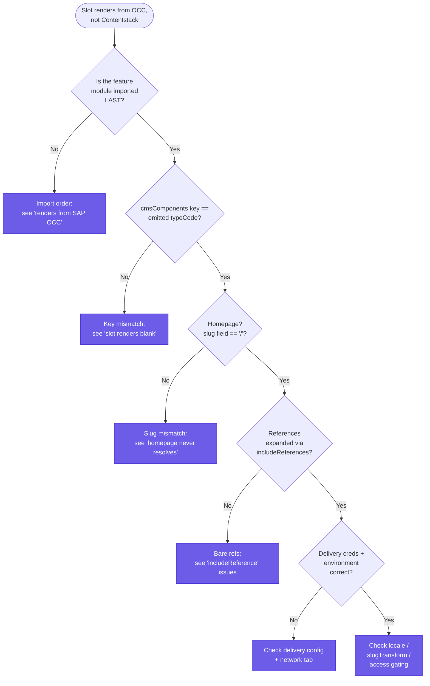

# Troubleshooting

Issues collected from building and running the connector end-to-end against a real Spartacus app, a live SAP OCC backend, and a live Contentstack stack. Mirrors the repository's [`TROUBLESHOOTING.md`](../TROUBLESHOOTING.md).

> [!NOTE]
> Two of these were real bugs, already fixed in this repo — kept here because the *shape* of the mistake is worth knowing if you extend the client or config wiring yourself. Those two are [`No provider found for ContentstackConfig`](#no-provider-found-for-contentstackconfig) and [`Property 'includeReference' does not exist on type 'Query'`](#property-includereference-does-not-exist-on-type-query).

## "Content isn't rendering from Contentstack" — start here

Most reports come in as "I authored it in Contentstack but the storefront still shows the old/SAP content." There is almost never an exception on the console for this — the connector converts a Delivery API failure to an *empty result* and Spartacus quietly falls back to OCC (see [hybrid rendering](#every-page-still-renders-from-sap-occ--contentstack-content-never-appears-no-error)). Walk the checks below in order; each leaf points at the section that fixes it.


*Diagnostic decision tree: the four checks that resolve the vast majority of "not rendering from Contentstack" reports.*

---

## Every page still renders from SAP OCC — Contentstack content never appears (no error)

**Symptom:** the app builds and runs fine, but pages come straight from SAP OCC; nothing you author in Contentstack shows up, and **no error or warning is logged**.

**Cause:** `ContentstackCmsFeatureModule` was imported *before* the stock Spartacus feature/OCC modules, or not imported at all. The connector overrides the abstract `CmsPageAdapter` / `CmsComponentAdapter` tokens and relies on Angular DI's *last-provider-wins* rule, so it must be imported **after** the base modules (which include `CmsOccModule`). The module is deliberately eager — its JSDoc notes it does **not** use the lazy `CmsConfig.featureModules` gate, because that gate only fires when a feature-tagged `cmsComponents` entry renders, which the connector never registers; an earlier version *was* lazy and silently never activated.

**Fix:** import `ContentstackCmsFeatureModule` **last** in `SpartacusFeaturesModule` (or after `StorefrontModule`). Confirm you import the *feature* module, not `ContentstackCmsModule` on its own — see the next-but-one issue. See [DI ordering](concepts.md#di-ordering-last-provider-wins-and-fails-silently) and [Option B — manual](installation.md#option-b-manual).

> The silence is a feature of hybrid mode, not a bug: with `occFallback: true` (default), OCC is the base for every route and Contentstack overrides only the slots it authors, so a non-activating connector looks identical to "no overrides authored yet."

---

## A slot renders blank / nothing shows for a block

**Symptom:** the page resolves and other slots render, but one component's slot is empty — no content, no error.

**Cause:** the `cmsComponents` map key doesn't exactly match the `typeCode` the normalizer emits. Spartacus looks up the Angular component to render by that typeCode; a near-miss (wrong case, display name, or the raw uid where a mapped value was expected) resolves to nothing and the slot stays blank.

**Fix:** the key in your `provideDefaultConfig(<CmsConfig>{ cmsComponents: { ... } })` must be *identical* to the SAP typecode the normalizer emits — the referenced component's Contentstack content-type uid mapped through [`src/cms/model/slot-maps.ts`](../src/cms/model/slot-maps.ts) (e.g. content type `simple_responsive_banner_component` → typeCode `SimpleResponsiveBannerComponent`; a custom type not in the map falls back to its raw uid). Not a display name or arbitrary label. This is the most common first mistake. See [`custom-hero.module.ts`](../src/examples/hero-banner/custom-hero.module.ts) and [Field naming and SAP mapping](content-model.md#field-naming-and-sap-mapping).

---

## `No provider found for ContentstackConfig`

**Symptom:** the app throws at bootstrap (or on the first CMS request) with `No provider found for ContentstackConfig` — nothing renders.

**Cause:** the typed `ContentstackConfig` accessor wasn't bound to Spartacus's merged global `Config` token. `ContentstackConfig` is an abstract class provided so config can be injected type-safely; it only resolves because `ContentstackCmsFeatureModule` binds it with `{ provide: ContentstackConfig, useExisting: Config }`. *(Real bug, fixed by adding that provider to `ContentstackCmsFeatureModule` — it mirrors Spartacus's own `{ provide: CmsConfig, useExisting: Config }`.)*

**Fix:** always import **`ContentstackCmsFeatureModule`** (not just `ContentstackCmsModule` on its own) — the binding lives there. If you see this on a very old checkout, pull latest.

---

## `Property 'includeReference' does not exist on type 'Query'`

**Symptom:** a TypeScript compile error on the client service (or your fork of it) at the `.includeReference(...)` call.

**Cause:** in `@contentstack/delivery-sdk`, `includeReference()` lives on the `Entries` object (returned by `.entry()`), not on `Query` (returned by `.query()`). Chaining it after `.query()` doesn't type-check. *(Real bug here, already fixed in `ContentstackClientService`.)*

**Fix:** if you extend or fork the client service, apply `.includeReference(...)` to the result of `.entry()` **before** calling `.query()`, exactly as [`ContentstackClientService.getPageBySlug`](../src/client/contentstack-client.service.ts) does:

```ts
let entries = this.stack.contentType(contentTypeUid).entry();
if (includeRefs.length) {
  entries = entries.includeReference(includeRefs); // on Entries, pre-.query()
}
return entries.query().where(slugField, QueryOperation.EQUALS, slug).find();
```

If a page's referenced components arrive as bare uid refs with no content, the fix is usually the same call — populate `contentstack.includeReferences` so the reference fields are expanded in one Delivery call (see [`configuration`](configuration.md)).

---

## Standalone component lookup returns empty + a console warning

**Symptom:** `[ContentstackCmsComponentAdapter] load(...)` / `findComponentsByIds(...)` warns "contentstack.componentContentType is not configured" and returns nothing.

**Cause:** expected — the primary path delivers component data embedded in the page payload (via the page normalizer, which emits `components[]` that Spartacus loads directly into the CMS store). The component adapter is only exercised when Spartacus requests a shared/reusable component by uid that isn't already in the store, and that path needs `componentContentType` to know which content type to query.

**Fix:** only set `contentstack.componentContentType` if you actually use standalone/shared components outside a page's references. Otherwise this warning is harmless and no content is missing — the components ship inside the page.

---

## The homepage (or a specific page) never resolves

**Symptom:** the homepage (or one content page) shows OCC content or not-found while sibling pages resolve from Contentstack correctly.

**Cause:** the connector maps Spartacus's `HOME_PAGE_CONTEXT` to the slug `/`. `getPageBySlug` queries `slugField EQUALS <slug>` exactly, so if your homepage entry's `url` field isn't literally `/`, the query returns nothing. More generally, any page fails when OCC's route doesn't match the CMS-authored slug byte-for-byte (a locale or category prefix OCC includes that the CMS entry omits, differing separators, and so on).

**Fix:** make sure the homepage entry's slug field value is exactly `/`, or adjust `slugField`/your content model to match. Rather than reauthoring every entry's slug, configure `slugTransform: { pattern, replacement }` to rewrite the route before it's queried — e.g. `{ pattern: /^\/en\//, replacement: '/' }` turns `/en/about-us` into `/about-us`. Note `slugTransform` only applies to per-route content pages; page types resolved via `ContentstackPageTypeMapping.sharedSlug` use that fixed value directly and are never route-derived. See [Notes on selected options](configuration.md#notes-on-selected-options).

---

## `ERR_CERT_AUTHORITY_INVALID` or `Http failure response ... 0 undefined` calling OCC

**Symptom:** OCC (product, cart, checkout) data fails to load; the network tab shows status `0` or a certificate-authority error. This is the SAP side, not Contentstack.

**Cause:** a self-signed TLS certificate on a dev/local SAP Commerce backend — normal for non-production, and enforced strictly by real browsers (unlike `curl`, which you can tell to skip verification).

**Fix (dev only):**
- **Browser (CSR):** open the OCC base URL directly once and click through the security warning to add an exception for that origin.
- **Node/SSR:** run the server with `NODE_TLS_REJECT_UNAUTHORIZED=0` (**dev only** — never in production; production SAP Commerce has valid certs, so this doesn't apply there).

---

## `ng add @spartacus/schematics` installs an old Spartacus (v4.x, Angular 12)

**Symptom:** a fresh scaffold pulls Spartacus `4.3.8` on Angular 12, incompatible with this connector's Angular-21-era target.

**Cause:** public npm's `@spartacus/*` packages haven't been updated in years and cap out around `4.3.8`. The current Composable Storefront line is distributed **only** via SAP's private RBSC registry, which requires an SAP Universal ID.

**Fix:** register for RBSC access, or — if you already have a modern Spartacus source vendored locally — consume that directly instead of via public npm.

---

## A code/config fix doesn't seem to take effect after rebuilding

**Symptom:** you change connector code or config, rebuild, and the running app behaves as if nothing changed.

**Cause:** (monorepo/local-dev setups only) your build tool cached the previous output, and the connector — consumed via a symlink or tsconfig path mapping rather than a real npm-published version — isn't tracked as a build input, so the cache isn't invalidated.

**Fix:** force a clean/no-cache rebuild (e.g. `nx run <app>:build --skip-nx-cache`). Not applicable if you installed this package normally from npm. On SSR builds, also remember the client replays server results from `TransferState` on first hydration; a hard reload avoids reading a stale server-rendered payload.

---

## Console warnings `NG05001` / `NG0505` about hydration

**Symptom:** the browser console logs `NG05001` / `NG0505` hydration warnings on load.

**Cause:** benign, expected on a pure client-side (`noSsr`) build — Angular notices there's no server-rendered payload to hydrate into. The page still renders correctly; nothing about the connector is broken.

**Fix:** none needed. If you're running SSR and see this, double-check `provideClientHydration()` is configured in your server bootstrap.

---

## Related

- [installation](installation.md) — correct wiring and verification
- [concepts](concepts.md) — why ordering matters and how page-type resolution works
- [configuration](configuration.md) — `slugTransform`, `componentContentType`, `includeReferences`
